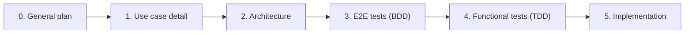
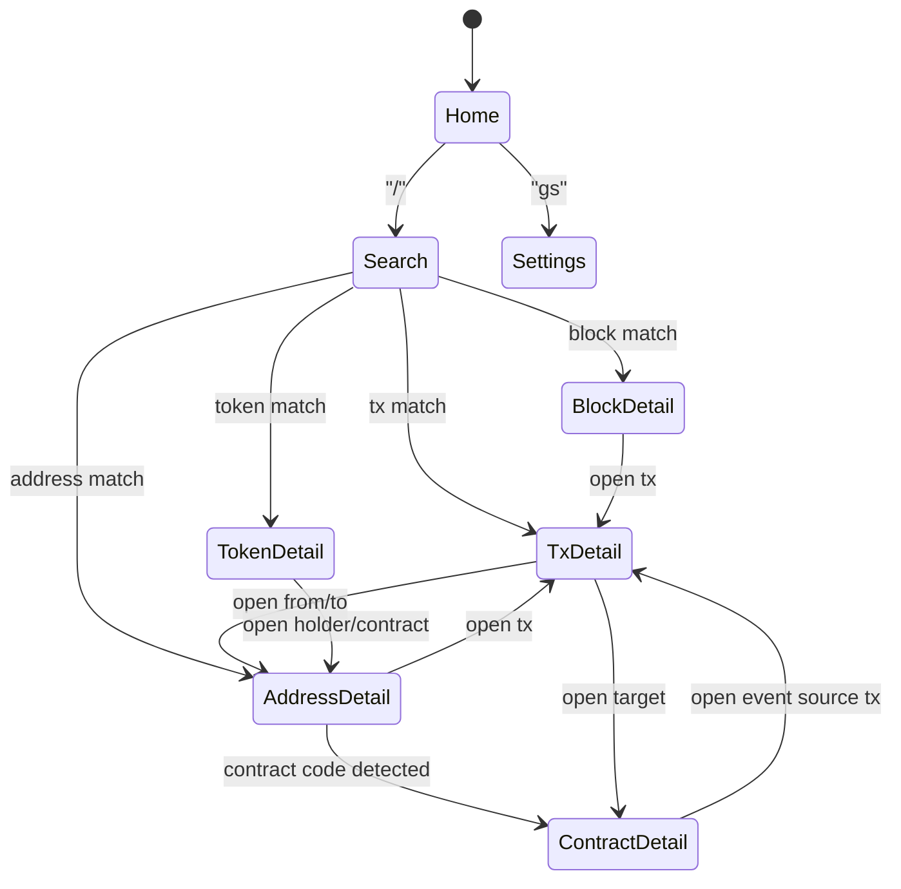
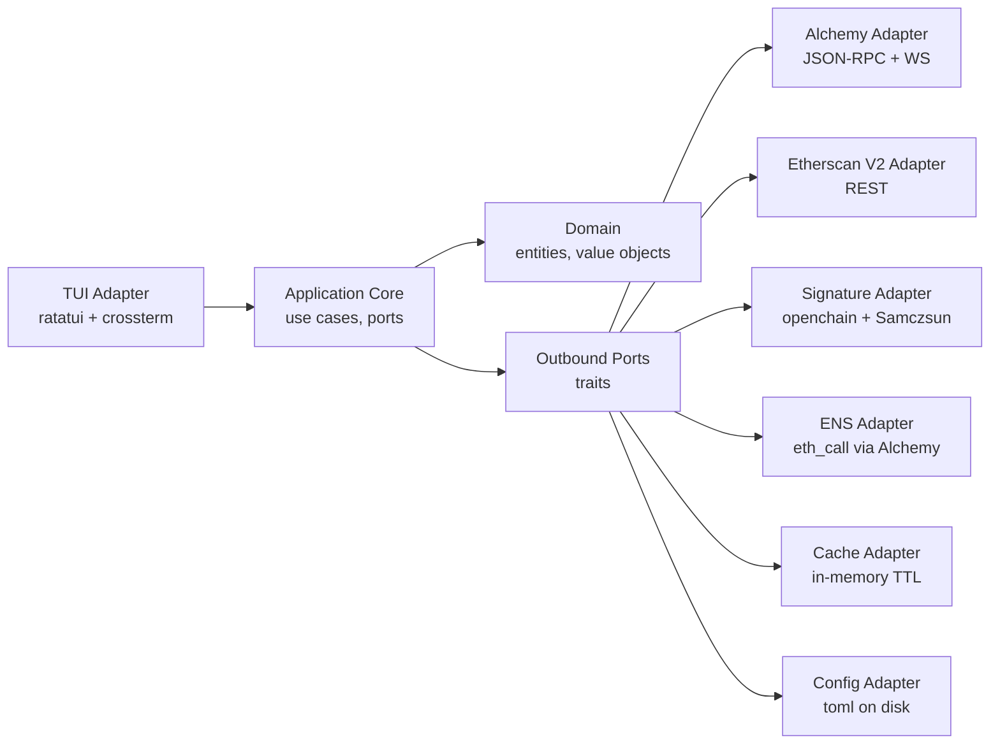
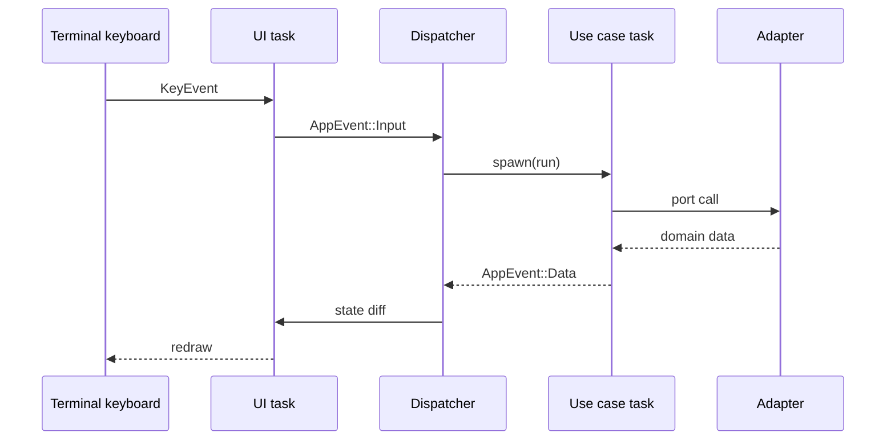

# 0 — General Architecture

This document is the source of truth for the overall shape of the TUI application: how
the user navigates between screens, how the codebase is laid out, and how features are
delivered. Every other plan file (`1-home.md`, `2-search.md`, ...) refines a single
screen inside the skeleton defined here.

## 1. Working philosophy

We always move through the pipeline below. A screen is never "done" until every stage
has been signed off.



Rules:

- No implementation is written before the matching plan section exists and the tests
  for that section are red.
- Tests are the executable specification. If a behaviour is not described by a test, it
  is not part of the product.
- All external I/O is stubbed in tests. A matching fixture file lives under
  `tests/fixtures/` for every scenario.
- There is no indexer. Every byte of on-chain data is pulled live from an external API
  (Alchemy, Etherscan V2, openchain.xyz, Samczsun signature DB).

## 2. Navigation philosophy

The TUI behaves like a small web browser made of keyboard shortcuts.

- **Screen stack**: a `push`/`pop` list of screens. `Esc` or `b` pops. Opening any
  entity (block, tx, address, contract, token) pushes a new screen.
- **Universal search** (`/`): resolves any input (block number, tx hash, address, ENS
  name, token ticker) and navigates straight to the matching detail screen. Since we
  removed the block list and the transactions list, search is the primary entry point
  to exploration.
- **Command palette** (`:`): runs any named action (open settings, switch chain, copy
  current id, toggle theme, ...). Actions are declared as data so they can be listed.
- **Modals** (help, input prompt, confirmations) render on top of the current screen
  without pushing on the stack.
- **Chain switcher** lives in the Home header (`c`) and also in Settings. Switching
  chain invalidates the per-chain cache and re-runs whatever subscription the current
  screen holds.

### Screen stack model



## 3. Global screen layout

Every screen shares the same chrome. Only the content area is screen-specific.

```
+-- Header -----------------------------------------------------------+
| [Chain: Ethereum v]  Block #21,345,678   Gas 12 gwei   v 3s         |
+-- Breadcrumb -------------------------------------------------------+
| Home > Tx 0xabc...def > Address 0x123...                            |
+-- Content ----------------------------------------------------------+
|                                                                     |
|                (screen-specific view, possibly tabbed)              |
|                                                                     |
+-- Status bar -------------------------------------------------------+
| ? help  / search  : cmd  b back  q quit        [Connected  45ms]    |
+---------------------------------------------------------------------+
```

The header, breadcrumb and status bar are drawn by the shell (not by individual
screens). Screens only own the content area.

### Shipped in §8.16 (cross-cutting first pass)

- `render_breadcrumb(stack)` pure helper in `src/adapters/ui/breadcrumb.rs`
  derives the breadcrumb trail from the current `ScreenStack` (title per
  screen joined with ` > `). Functional-tested against a representative
  stack shape in `tests/functional/render_breadcrumb.rs`, including the
  "open modal must not appear on the trail" invariant. The shell
  integration of the helper (so every screen renders the breadcrumb
  without having to call it itself) is still queued.
- `CacheRegistry` (`src/adapters/cache/registry.rs`) centralises the TTL
  constants for named namespaces so composition roots and decorators
  agree on the numbers: `ens_reverse` 5 min, `abi` 5 min, `search`
  60 s, `health` 30 s. The decorators (`CachedEnsResolver`,
  `CachedEtherscanProxyHint`) and the search feed read their TTLs from
  the registry instead of hard-coded constants.
- Shared BDD step library (`tests/e2e/steps/shared.rs`) owns the
  `Given the user is on Home` / `Given the active chain is "..."` /
  `Given the user launches the app` givens that every feature file
  reuses. Individual feature modules register their own scenario-
  specific givens but stop redefining the common ones.
- `pretty_assertions::assert_eq!` is wired across every test module
  that compares structured values; loose `assert!(matches!(…))` usages
  on enum shapes are migrated to `assert_matches!`.
- Adapter happy-path + 5xx error fixtures: the Alchemy RPC client,
  the Etherscan V2 client and the Alchemy Prices client each ship a
  `*__error__*5xx.json` fixture feeding a wiremock-driven test that
  asserts the adapter maps HTTP 5xx to
  `DomainError::ProviderUnavailable`. See
  `tests/functional/rpc_error_mapping.rs`,
  `tests/functional/etherscan_contract_source.rs` (server_5xx_…)
  and `tests/functional/alchemy_prices.rs` (server_5xx_…). The
  openchain-shape signature adapter intentionally keeps its current
  "non-2xx → Ok(None)" policy so a transient signature-directory
  outage does not block tx-detail decoding; the composite falls
  through to the Samczsun mirror instead.

### Still deferred (tracked in `plan/15-backlog.md` §8.16)

- Application-shell polish: command palette `:`, chain-switcher
  modal, status bar footer, dynamic tick rate, `StatusPort`, and the
  data-driven `KeyMap` config overrides. The breadcrumb helper
  above is a shell ingredient; promoting it to a top-level chrome
  row is part of this work.
- Clipboard audit across screens (`arboard` currently stubbed).
- Per-screen narrow-terminal thresholds beyond Home.
- Remaining Beacon / blob-sidecar adapter.

## 4. Global keybindings

These bindings are valid on every screen unless explicitly overridden.

| Key           | Action                                            |
|---------------|---------------------------------------------------|
| `/`           | Open universal search                             |
| `:`           | Open command palette                              |
| `?`           | Context help (lists current screen bindings)      |
| `Esc` / `b`   | Pop current screen (back)                         |
| `Ctrl+H`      | Jump to Home                                      |
| `Ctrl+N`      | Open chain picker                                 |
| `Ctrl+R`      | Refresh the current screen's data                 |
| `gs`          | Go to Settings                                    |
| `gh`          | Go to Home                                        |
| `gg` / `G`    | Jump to top / bottom of a list                    |
| `j` / `k`     | Move down / up in a list                          |
| `Tab`         | Next pane or tab                                  |
| `Shift+Tab`   | Previous pane or tab                              |
| `Enter`       | Open selected item (push detail screen)           |
| `y`           | Yank (copy) selected identifier to clipboard      |
| `p`           | Pause/resume a live subscription                  |
| `q`           | Quit                                              |

Screen-specific bindings extend this table and are listed inside each plan file.

## 5. Cross-cutting UX concerns

- **Loading**: a screen that waits on the network renders a skeleton with a spinner in
  the status bar. No spinner inside the content area.
- **Empty state**: every list must have an empty-state message that explains why (for
  example "No transfers in the last 1,000 blocks for this address").
- **Errors**: surface as a dismissible modal with the raw error plus a suggested
  retry. Transient errors are retried automatically per the retry policy in
  `.cursor/rules/external-apis.mdc`.
- **Theming**: palette is loaded from config. Two built-in themes (dark default, light
  fallback). Colours are referenced by semantic token, never by raw RGB in widgets.
- **Clipboard**: `y` copies the most relevant identifier on the current screen (tx
  hash, address, block number). Uses the OS clipboard via `arboard`.
- **Discoverability**: `?` lists every binding active right now. The command palette
  is the canonical list of actions.

§8.16 status: help modal (`?`) landed in §8.13; the command palette
(`:`) and the chain-switcher modal are still queued. Colour palette
landed in §8.11; semantic tokens (`Theme::accent/warning/success`)
are exposed on the palette and already drive every built-in widget,
but a formal audit across every screen is still deferred.

## 6. Hexagonal architecture

The application follows Ports and Adapters with a DDD-flavoured domain layer.



### Layer responsibilities

- **Domain** (`src/domain/`): pure types and invariants. No `async`, no I/O, no
  serialization. Contains value objects (`Address`, `TxHash`, `BlockNumber`, `Chain`,
  `Wei`, `Gwei`, `UnixTimestamp`, ...), entities (`Block`, `Transaction`, `Account`,
  `Contract`, `TokenMetadata`, ...) and domain errors.
- **Application** (`src/application/`): orchestration. Defines ports as `trait`s and
  implements use cases that depend on ports, never on concrete clients. Use cases are
  plain `async fn`s or small structs with a `run` method. Returns only domain types.
- **Adapters** (`src/adapters/*`): each adapter implements one or more ports.
  Adapters own serde types, HTTP clients, retry logic, and map raw responses into
  domain types.
- **Infra** (`src/infra/`): composition root. Reads config, constructs adapters,
  wires them into use cases, starts the Tokio runtime, and launches the TUI.

### Import rules (enforced by review and by `cargo-deny`/`cargo-modules`)

- `domain` imports nothing from the crate.
- `application` imports `domain` only.
- `adapters::*` import `domain` and `application`.
- `adapters::ui` must not import any other `adapters::*`. The UI talks to the app core
  through application-level ports passed in by `infra`.
- `infra` is the only place that may import every module.

## 7. Module layout

```
blockexplorer-tui/
  Cargo.toml
  rust-toolchain.toml
  src/
    main.rs                      # bootstraps infra::run
    domain/
      mod.rs
      address.rs                 # Address value object + validation
      block.rs                   # Block entity
      chain.rs                   # Chain enum + metadata
      gas.rs                     # Wei / Gwei newtypes
      tx.rs                      # Transaction + Receipt
      contract.rs                # Contract entity + proxy info
      token.rs                   # TokenMetadata, AssetChange
      errors.rs                  # DomainError
    application/
      mod.rs
      ports/                     # trait definitions, one file per capability
        mod.rs
        block_reader.rs
        tx_reader.rs
        tx_trace.rs
        tx_simulation.rs
        address_reader.rs
        transfers.rs
        portfolio.rs
        prices.rs
        gas_oracle.rs
        network_status.rs
        pending_tx_stream.rs
        contract_source.rs
        contract_reader.rs
        event_log.rs
        storage.rs
        signature_directory.rs
        ens_resolver.rs
        label.rs
        chain_registry.rs
        config.rs
      use_cases/                 # one file per use case, mirrors plan sections
        mod.rs
        observe_network_status.rs
        observe_gas_oracle.rs
        switch_chain.rs
        resolve_query.rs
        load_block_overview.rs
        load_block_transactions.rs
        load_tx_overview.rs
        decode_tx_logs.rs
        load_internal_calls.rs
        load_state_diff.rs
        load_asset_changes.rs
        load_address_overview.rs
        load_address_transfers.rs
        load_address_portfolio.rs
        load_address_activity.rs
        load_contract_overview.rs
        load_contract_source.rs
        invoke_read_function.rs
        detect_proxy_implementation.rs
        load_contract_events.rs
        load_token_overview.rs
        load_token_transfers.rs
        load_token_price_history.rs
        load_config.rs
        update_config.rs
        validate_provider_credentials.rs
    adapters/
      mod.rs
      rpc/                       # Alchemy JSON-RPC + WS client
      etherscan/                 # Etherscan V2 REST client
      signatures/                # openchain + Samczsun
      ens/                       # eth_call based resolver
      cache/                     # moka-backed TTL cache
      config/                    # toml loader
      ui/                        # ratatui screens, widgets, input router
    infra/
      mod.rs
      wiring.rs                  # composition root
      logging.rs
      runtime.rs
  tests/
    e2e/
      features/                  # .feature files (Gherkin)
      steps/                     # step definitions
      world.rs                   # cucumber World with stubbed ports
    functional/                  # per-use-case tests
    support/
      stubs.rs                   # StubBlockReader, StubGasOracle, ...
      fixture_loader.rs
    fixtures/                    # {adapter}__{method}__{case}.json
  plan/
    0-general-architecture.md
    1-home.md
    ...
  .cursor/
    rules/*.mdc
```

## 8. Runtime model

- Single Tokio multi-thread runtime started in `main.rs`.
- A **UI task** owns the terminal and the render loop.
- A **dispatcher task** owns the screen stack, receives `AppEvent`s (keyboard, ticks,
  data deliveries) and mutates the stack.
- **Background tasks** are spawned per active subscription or per long-running use
  case. They deliver updates through `tokio::sync::mpsc::Sender<AppEvent>`.
- The UI task never awaits on I/O. It only reads the screen stack snapshot and draws.



## 9. Configuration and secrets

- Config file at `~/.config/blockexplorer-tui/config.toml`. Schema is versioned.
- Secrets: `ALCHEMY_API_KEY`, `ETHERSCAN_API_KEY` read from env first, then config
  file. Never logged, never embedded in binaries.
- First run without credentials drops the user into Settings with a guided prompt.

## 10. Testing strategy (summary)

Full rules live in `.cursor/rules/testing.mdc`. In short:

- **E2E (BDD)**: `cucumber` crate. Every MVP screen has a `.feature` file that walks
  the screen stack the same way a user would, driving the application through the
  `ScreenStack`'s public API. All outbound ports are replaced with stubs loaded from
  fixtures.
- **Functional (TDD)**: every use case has an `rstest`-parameterized suite covering a
  happy path and at least one failure path. Ports are stubbed.
- **Unit**: value objects and domain logic are tested with plain `#[test]`. No mocks
  needed because the domain layer has no I/O.
- **No network**: CI runs with `RUSTFLAGS="--deny warnings"` and with network access
  disabled. Any test that attempts a real HTTP call fails immediately.

## 11. Out of scope for MVP

Explicitly deferred and only referenced as "future work":

- NFT detail screen and NFTs tab in Address detail.
- Holders tab in Token detail.
- Watchlist screen and persistent alerts.
- Transaction simulator screen.
- Beacon chain / validators screen.
- Blocks list and Transactions list (removed entirely, not just deferred).
- Writing to contracts (requires a signer); the Read tab is MVP-only.

Each of these gets its own plan file when the time comes.
