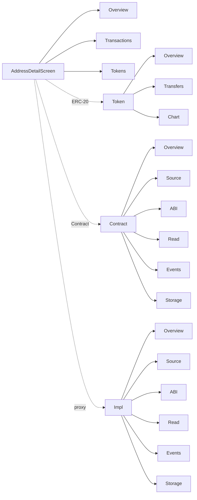
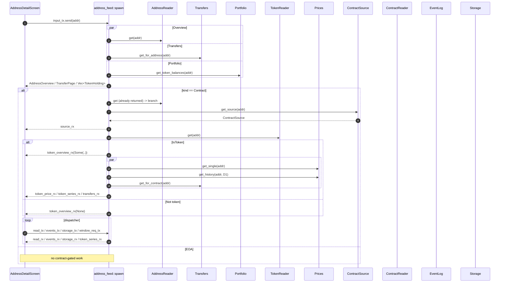

# 16 — Unified Address Detail

Status: **ready** — plan accepted; implementation lands in
Slice 3 of the "unified detail screen + global UX" plan at
`/home/leo/.cursor/plans/unified_detail_screen_+_global_ux_71d8327f.plan.md`.

Supersedes [`plan/6-address-detail.md`](6-address-detail.md),
[`plan/7-contract-detail.md`](7-contract-detail.md) and
[`plan/8-token-detail.md`](8-token-detail.md) for the **UI shell**:
those files remain as history for the use cases, ports and adapters
that power each tab; this plan owns the single screen that hosts
them.

## 1. Motivation

Prior to this slice, a search result for an ERC-20 contract could
open any of three distinct screens (`AddressDetailScreen`,
`ContractDetailScreen`, `TokenDetailScreen`). The user lost context
each time they jumped between the "wallet view" and the "contract
view" of the same address, and the tab bar did not agree with the
underlying entity. Slice 3 folds the three screens into
`AddressDetailScreen` with conditional tabs that reveal the full
contract and ERC-20 surface in-place.

## 2. Tab tree

Conditional on `AddressKind` (from the reader) and `TokenProbeState`
(from the ERC-20 probe run only for contracts).

| Kind / probe                          | Main tabs                                              |
|---------------------------------------|--------------------------------------------------------|
| EOA (including 7702-delegated EOA)    | Overview, Transactions, Tokens                         |
| Plain contract (`TokenProbeState::NotToken`) | Overview, Transactions, Tokens, Contract        |
| Contract with proxy (`ContractOverview::proxy`) | Overview, Transactions, Tokens, Contract, **Impl** |
| ERC-20 (`TokenProbeState::IsToken`)   | Overview, Transactions, Tokens, Token, Contract (+ **Impl** when proxy metadata is present)        |

### 2.1 Contract implementation tab (`Impl`)

When [`ContractOverview`](src/domain/contract.rs) includes [`ProxyInfo`](src/domain/contract.rs), the main tab strip gains **Impl** (next to **Contract**). Sub-tabs match **Contract** (Overview, Source, ABI, Read, Events, Storage). Data for Overview, Source, ABI, Events, and Storage views is loaded for the **implementation address** (`ProxyInfo::implementation`) via extra feed channels (`contract_impl_overview_rx`, `source_impl_rx`) filled by `address_feed::spawn` after the proxy overview is known.

**Read tab:** calldata is built from the **implementation** ABI (same as the **Impl** / ABI tab). `eth_call` / `ContractReaderPort::call` still uses the **user-facing proxy address** as `to`, matching delegatecall semantics. The UI routes async read results with [`ReadCalldataSource`](src/adapters/ui/address_detail.rs) (`ProxyArtifact` vs `ImplementationArtifact`).

Sub-tabs live in a second tabs row drawn directly below the main
tabs row **only when** `active_tab` is `Contract` or `Token`. The
main tab row keeps the same style (bold + indexed bg) as every
other screen (`.cursor/rules/tui.mdc`).

## 3. Keybindings

Owned by the screen; `GlobalKeyMap` still intercepts `/` and `?`.

| Key               | Effect                                                                              |
|-------------------|-------------------------------------------------------------------------------------|
| `Tab` / `Shift+Tab` (or `BackTab`) | With focus on body or **main** tab strip: cycle **main** tabs. With focus on **sub** tab strip: cycle **sub** tabs only. |
| `←` / `→`         | When **main** tab strip is focused: previous / next main tab. When **sub** strip is focused: previous / next sub-tab. |
| `↑` / `↓`         | Move focus between main strip → sub strip (if any) → body; in body, arrows keep cursor / list / scroll semantics; `↑` at list top promotes focus upward. |
| `]` / `[`         | Cycle the **sub** tab bar forward / backward (only when visible), from any focus layer. |
| Arrow keys on Overview | With **body** focus: field cursor / scroll (`k`/`j` unchanged).                |
| Arrow keys on list tabs (Transactions, Tokens, Token/Transfers, Contract/Events) | With **body** focus: Up/Down navigate rows. |
| `q`               | `Command::Quit`.                                                                     |
| `Esc`             | `Command::Pop`, protected by the Home-root guard shipped in Slice 1.                |
| `Enter`           | Open the selected row (Transactions → TxDetail, Tokens/holdings → AddressDetail for the contract, Token/Transfers → TxDetail). |
| `y` / `Y` / `e`   | Clipboard bindings from plan/6 §11, unchanged.                                      |
| `1` / `2` / `3`   | Select Token chart window when the Token sub-tab or its Chart sub-tab is active.    |
| `n` / `N`         | Events sub-tab: page older / newer. `r` refreshes the current window.               |
| `c`               | Token sub-tab: "View as Contract" shortcut when the token is incomplete (plan/8 §13.2); simply jumps to the Contract sub-tab since both tabs live in the same screen. |

Sub-tab cycling deliberately chose `]`/`[` over `Ctrl+Tab` because
`Ctrl+Tab` is unreliable across terminal emulators and because
`]`/`[` already feel idiomatic on Vim-style UIs.

## 4. Data plumbing

Domain types: no changes. `AddressKind`, `AddressOverview`,
`TokenOverview`, `TokenProbeState`, `ContractOverview`,
`ContractSource`, `EventsPage`, `PriceLookup`, `PriceSeries`,
`TransferPage` all stay as-is.

Ports: no new ports. The feed composes the existing set.

Channels owned by `AddressFeed` (a single `Feed`/`FeedSender` pair
from `src/adapters/ui/address_detail.rs`):

Always-on (fan out immediately for every address):

- `updates_rx` — `AddressOverview`
- `transfers_rx` — `TransferPage` (account history)
- `portfolio_rx` — `Vec<TokenHolding>`

Contract-gated (lazy; fired only after the first overview confirms
`AddressKind::Contract`):

- `source_rx` — `ContractSource`
- `proxy_rx` folded into `contract_overview_rx` — `ContractOverview` with proxy info
- `contract_impl_overview_rx` — second `ContractOverview` for `ProxyInfo::implementation` (only when proxy is detected)
- `source_impl_rx` — `ContractSource` for the implementation address
- `read_tx` / `read_rx` — `ReadRequest` → [`ReadDelivery`](src/adapters/ui/address_detail.rs) (result + `ReadCalldataSource` for UI routing); the feed still calls `ContractReaderPort` with the active **proxy** address
- `events_tx` / `events_rx` — `EventsRequest` → `EventsPage`
- `storage_tx` / `storage_rx` — `StorageRequest` → `[u8; 32]`

ERC-20-gated (lazy; fired only after the probe returns
`Ok(Some(TokenOverview))`):

- `token_overview_rx` — `Option<TokenOverview>` (tri-state flip)
- `token_price_rx` — `PriceLookup`
- `token_series_rx` — `PriceSeries`
- `token_window_req_tx` — request a non-default `PriceWindow`

## 5. Feed composition

`src/infra/address_feed::spawn` absorbs the job of the three prior
feeds. Port bounds added:

- `ContractSourcePort`
- `ContractReaderPort`
- `EventLogPort`
- `StoragePort`
- `NetworkStatusPort`
- `ProxyDetectionPort`
- `TokenPriceStreamPort`

Lazy dispatch keeps the CU budget flat for EOAs:

1. On a new `Address`:
   - Fan out `load_address_overview`, `TransfersPort::get_for_address`,
     `load_address_portfolio` in parallel.
2. Once the overview arrives, if `AddressKind::Contract`:
   - Spawn the Contract composite (source fetch, proxy-aware
     overview, and the request dispatcher loop for Read / Events /
     Storage).
   - Run the ERC-20 probe (`TokenReaderPort::get`). If positive, also
     kick off the Token composite (spot price, D1 history, transfer
     stream filtered by contract address, live price subscription).

The dispatcher loop uses `tokio::select!` and closes when its
input channel drops (screen teardown). See section 6 below for the
exact shape.

`src/infra/contract_feed.rs` and `src/infra/token_feed.rs` are
**deleted**. All callers now route through
`src/infra/address_feed::spawn`.

## 6. Sequence diagram

## 7. Composition root

`src/infra/mod.rs`:

- `live_address_detail_screen(chain, address, initial_main_tab)` is
  now the only factory.
- `live_contract_detail_screen` and `live_token_detail_screen` are
  deleted. Anything that used to call them now calls
  `live_address_detail_screen` with an `initial_main_tab` hint.
- `detail_factory` in both the `build_live_search_screen` and
  `build_live_stack` closures routes:
  - `ResolvedEntity::Block { .. }` → `BlockDetailScreen`.
  - `ResolvedEntity::Tx { .. }` → `TxDetailScreen`.
  - `ResolvedEntity::Address { address, kind, .. }` → `AddressDetail(Overview)`.
  - `ResolvedEntity::DelegatedEoa { address, .. }` → `AddressDetail(Overview)`.
  - `ResolvedEntity::Contract { address }` → `AddressDetail(Contract)`.
  - `ResolvedEntity::Token(meta)` → `AddressDetail(Token)` at
    `meta.address`.

## 8. Tests

### 8.1 BDD

Single feature file `tests/e2e/features/address_detail.feature`
covers every scenario that lived in the three prior files:

- EOA: Overview + Transactions + Tokens shape, Transactions row
  Enter opens TxDetail, Tokens row Enter opens AddressDetail
  focused on the held token.
- Plain contract: tab bar gains Contract; Contract sub-tabs
  (Source with verified single file; ABI populated; Read invokes a
  view and surfaces revert; Events lists N logs, `n`/`N` pages;
  Storage reads the requested slot).
- ERC-20 (IsToken): tab bar gains both Token and Contract; Token
  sub-tabs (Overview shows symbol/decimals/price, Transfers list
  lets Enter jump to TxDetail, Chart renders D1 and `2` selects
  M1).

`contract_detail.feature` and `token_detail.feature` are deleted;
their scenarios migrate verbatim into address_detail.feature with
`Given the user opens AddressDetail with <wiring>`/`When the user
switches to the Contract tab`/`And the user switches to the 
sub-tab`.

### 8.2 Functional

- `tests/functional/address_detail_screen_keys.rs` (existing) — stays.
- `tests/functional/address_detail_tabs.rs` (new):
  - `eoa_shows_three_main_tabs_and_no_subtabs`.
  - `plain_contract_shows_four_main_tabs_with_contract_subtabs`.
  - `erc20_shows_five_main_tabs_with_token_and_contract_subtabs`.
  - `switching_to_contract_tab_activates_source_subtab_by_default`
    (Overview → Source → ABI → Read → Events → Storage; cycling
    back lands on the first sub-tab).
  - `bracket_keys_rotate_contract_subtabs`.
  - `bracket_keys_rotate_token_subtabs`.
- `tests/functional/address_detail_contract_subtabs.rs` (new):
  Source highlight (`pragma` keyword cyan+bold), Read invocation,
  Events pagination, Storage read. Migrated from
  `contract_detail_source_highlight.rs` and the contract-specific
  BDD `plan/7 §12.5.4` coverage.
- `tests/functional/address_detail_token_subtabs.rs` (new):
  incomplete-token badge + `c` shortcut, live price streaming,
  window switching. Migrated from `token_detail_screen_keys.rs`.

### 8.3 Snapshot

`tests/functional/address_detail_render.rs` (new): one snapshot
per `(AddressKind × main tab × sub-tab)` combination at 120×30.

## 9. Risks / non-goals

- **Port trait bounds grow.** `address_feed::spawn` now takes 11
  generic ports. This is acceptable because the function is called
  from a single place and the types are not spelled out in tests
  (the BDD helpers compose a local spawn loop instead).
- **CU budget.** Lazy dispatch keeps EOAs at exactly the same cost
  as today. Contracts cost a little more than the old
  `AddressDetailScreen` because the Contract composite now runs on
  first load; but the old flow paid that cost too, just inside the
  separate `ContractDetailScreen` that the user would open
  immediately afterwards. The net budget is flat.
- **Sub-tab keybindings.** `]`/`[` could clash with a future
  plan/17 field cursor. Plan/17 will document the precedence
  (screen-owned bindings resolve before field-cursor navigation).
- **No mouse.** Unchanged from the MVP contract.
