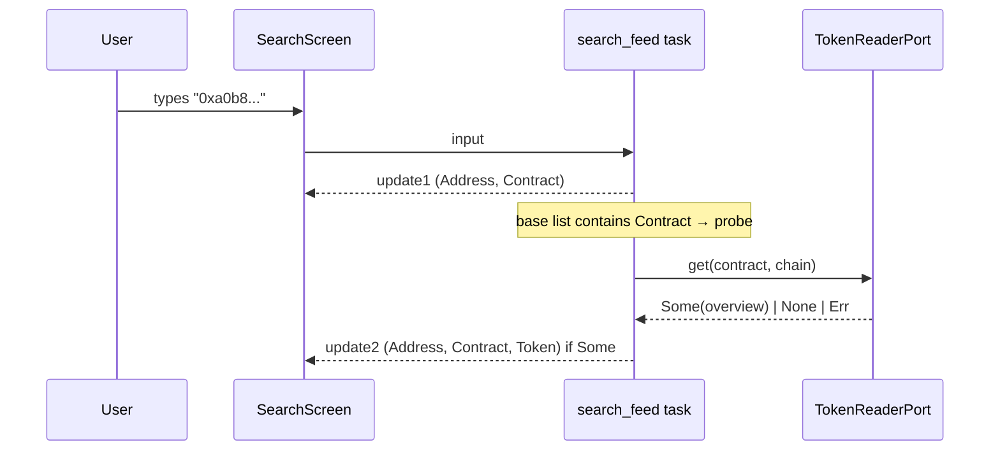

# 2 — Universal Search

Status: **done** — all five BDD scenarios in
`tests/e2e/features/search.feature` are green along with the
functional coverage under `tests/functional/`.

With the block list and the transaction list removed, the Search screen is the only
way to reach detail screens for entities the user does not already have on screen. It
must be fast, resilient to ambiguous input, and produce a single, obvious next step.

## 1. Purpose and user goals

- Accept any blockchain identifier or human handle and resolve it to a concrete
  `ResolvedEntity`.
- Show ranked candidates when the input is ambiguous, with enough detail for the user
  to pick.
- Handle "not found" gracefully with actionable hints.

## 2. Layout

```
+-- Search ----------------------------------------------------+
| >  0x8f3c...                                                 |
+--------------------------------------------------------------+
|  Type detected: transaction hash                             |
|  Chain: ethereum                                             |
|                                                              |
|  Candidates:                                                 |
|   > [tx]      0x8f3c...  block 21345001  success             |
|     [block]   hash 0x8f3c... (same value, unlikely)          |
|                                                              |
+-- Status bar ------------------------------------------------+
| Enter open   Tab next candidate   Esc cancel                 |
+--------------------------------------------------------------+
```

Search opens as a modal over whatever screen is active. Once the user picks a
candidate, the modal closes and a new detail screen is pushed on the stack.

## 3. Input detection rules

Applied in this order. First match wins, but if a later rule is still plausible it is
offered as an additional candidate.

| Pattern                                   | Primary interpretation        |
|-------------------------------------------|-------------------------------|
| `^0x[0-9a-fA-F]{64}$`                     | Transaction hash              |
| `^0x[0-9a-fA-F]{64}$` (fallback)          | Block hash                    |
| `^0x[0-9a-fA-F]{40}$`                     | Address (EOA or contract)     |
| `^[0-9]+$`                                | Block number                  |
| `^.+\.eth$` (and other namespaces later)  | ENS name -> forward resolve   |
| `^[A-Z]{2,10}$`                           | Token ticker (local list)     |
| Any other non-empty string                | Token or contract name search |

## 4. Use case: `ResolveQuery`

### 4.1 Signature

```
pub struct ResolveQuery { ... }

impl ResolveQuery {
  pub async fn run(&self, input: &str, chain: Chain)
    -> Result<Vec<ResolvedEntity>, DomainError>;
}

pub enum ResolvedEntity {
  Block { number: BlockNumber, hash: BlockHash },
  Tx { hash: TxHash, block: Option<BlockNumber> },
  Address { address: Address, is_contract: bool, ens_name: Option<String> },
  Token { address: Address, symbol: String, name: String },
  NotFound { reason: String },
}
```

### 4.2 Behaviour

1. Normalize: trim, lowercase hex, strip whitespace.
2. Classify against the table in section 3.
3. For each plausible classification, query the corresponding port in parallel.
4. Collect results, deduplicate, rank: exact type match first, ENS resolutions second,
   partial text matches last.
5. If the list is empty, return `vec![ResolvedEntity::NotFound { reason }]` with a
   human-readable reason (for example "No transaction and no block with hash
   0x8f3c... on ethereum").

### 4.3 Ports used

- `TxLookupPort::get(tx_hash, chain) -> Option<TxSummary>`
- `BlockLookupPort::get_by_hash(hash, chain) -> Option<BlockSummary>`
- `BlockLookupPort::get_by_number(n, chain) -> Option<BlockSummary>`
- `AddressLookupPort::classify(addr, chain) -> AddressKind` (EOA vs contract)
- `EnsResolverPort::forward(name, chain) -> Option<Address>`
- `TokenSearchPort::by_symbol(sym, chain) -> Vec<TokenMetadata>`
- `TokenSearchPort::by_name(text, chain) -> Vec<TokenMetadata>`

## 5. Data sources

- Tx / block lookups: Alchemy (`eth_getTransactionByHash`, `eth_getBlockByHash`,
  `eth_getBlockByNumber`).
- Contract classification: Alchemy (`eth_getCode`).
- ENS forward: `eth_call` on the ENS Public Resolver via Alchemy.
- Token search: Etherscan V2 (`getsourcecode` + local token list for popular symbols).

## 6. BDD scenarios (`tests/e2e/features/search.feature`)

```gherkin
Feature: Universal search

  Background:
    Given the user is on Home
    And the active chain is "ethereum"

  Scenario: Resolves a valid transaction hash
    When the user opens search with "0x8f3c...abcd"
    Then the primary candidate is "transaction"
    And pressing Enter pushes the TxDetail screen

  Scenario: Disambiguates between tx hash and block hash
    Given the hash "0xdead...beef" matches both a transaction and a block in the stub
    When the user opens search with "0xdead...beef"
    Then there are at least two candidates in the list
    And the first candidate is "transaction"

  Scenario: Resolves an ENS name
    Given "vitalik.eth" resolves to "0xd8dA..." in the stub
    When the user opens search with "vitalik.eth"
    Then the primary candidate is "address"
    And the candidate row shows the ENS name next to the address

  Scenario: Resolves a block number
    When the user opens search with "21345678"
    Then the primary candidate is "block"
    And pressing Enter pushes the BlockDetail screen

  Scenario: Not found with actionable hint
    Given the input "0x0000000000000000000000000000000000000000000000000000000000000001" matches nothing
    When the user opens search with that value
    Then the candidates list contains a single "not found" entry
    And the hint mentions the active chain name
```

## 7. Functional tests

- Classification table: parameterized test with the patterns from section 3.
- Parallel port calls: ensure a failure in one port does not block the others (test
  by stubbing one port with an artificial delay and another with an error).
- Ranking: exact type wins over ENS; ENS wins over text search.
- Normalization: uppercase hex, leading whitespace, "eth" lowercased handled.

## 8. Fixtures

- `rpc__eth_getTransactionByHash__found.json`
- `rpc__eth_getTransactionByHash__not_found.json`
- `rpc__eth_getBlockByHash__found.json`
- `rpc__eth_getBlockByHash__not_found.json`
- `rpc__eth_getBlockByNumber__found.json`
- `rpc__eth_getCode__eoa.json`
- `rpc__eth_getCode__contract.json`
- `ens__forward__vitalik_eth.json`
- `etherscan__getsourcecode__usdc.json`

## 9. Open questions

- Should we cache resolution results across opens of the modal? Yes, with a 60s TTL
  per (chain, input). Implemented in `CacheAdapter`.
- Should we support pasting a full URL (for example an etherscan.io link)? Out of
  scope for MVP, easy to add as another classification rule later.

## 10. Implementation plan

Delivered in three slices, each its own commit with the full red->green loop.

### 10.1 Slice A — domain, ports, use case, stubs (no network, no UI)

New or extended domain types (`src/domain/`):

- `address.rs` — `pub struct Address([u8; 20])` with `from_hex_prefixed` and a
  lowercase canonical hex string formatter.
- `tx.rs` — `pub struct TxHash([u8; 32])` with the same fallible constructor.
- `block.rs` — add `pub struct BlockHash([u8; 32])` next to `BlockNumber`.
- `token.rs` — `pub struct TokenMetadata { address: Address, symbol: String,
  name: String, decimals: u8 }`.
- `search.rs` — `pub enum ResolvedEntity { Block, Tx, Address, Token, NotFound }`
  plus `pub enum AddressKind { Eoa, Contract }` and light wrappers
  `BlockSummary`, `TxSummary`.

Ports (`src/application/ports/`):

- `block_lookup.rs` — `get_by_hash`, `get_by_number`.
- `tx_lookup.rs` — `get(hash, chain)`.
- `address_lookup.rs` — `classify(addr, chain) -> AddressKind`.
- `ens_resolver.rs` — `forward(name, chain) -> Option<Address>`, `reverse(addr,
  chain) -> Option<String>`.
- `token_search.rs` — `by_symbol(sym, chain) -> Vec<TokenMetadata>` and
  `by_name(text, chain) -> Vec<TokenMetadata>`.

Use case (`src/application/use_cases/resolve_query.rs`):

- Struct `ResolveQuery<'a, B, T, A, E, S>` holding references to the five ports.
- Method `async fn run(input, chain) -> Result<Vec<ResolvedEntity>, DomainError>`.
- Classification follows section 3's table; ambiguous inputs run every
  plausible lookup via `tokio::join!` so the slowest port does not block the
  others.
- Ranking rule: exact-type hits first, ENS resolutions second, plain text
  search last.
- Empty result yields `vec![ResolvedEntity::NotFound { reason }]` with a
  human hint mentioning the chain.

Stubs (`tests/support/stubs.rs`):

- `StubBlockLookupPort`, `StubTxLookupPort`, `StubAddressLookupPort`,
  `StubEnsResolverPort`, `StubTokenSearchPort`. Every stub carries a table
  primed by the test and a `set_broken` switch for the rate-limit scenario.

Tests (`tests/functional/resolve_query.rs`):

- Resolves a tx hash.
- Resolves a block number.
- Resolves an ENS name and exposes the underlying address as a candidate.
- Disambiguates a 64-hex value between tx and block.
- Reports `NotFound` with the active chain name.
- Treats an uppercase 3-char ticker as a token search input.
- Rejects empty input with `DomainError::InvalidInput`.

No UI or HTTP yet. Acceptance: `cargo test --test functional resolve_query`
green, `cargo clippy --all-targets -- -D warnings` clean.

### 10.2 Slice B — Alchemy adapters

Extend `src/adapters/rpc/` with four new adapters sharing the existing
`RpcClient`:

- `AlchemyTxLookup` using `eth_getTransactionByHash`.
- `AlchemyBlockLookup` using `eth_getBlockByHash` and `eth_getBlockByNumber`.
- `AlchemyAddressLookup` using `eth_getCode` for EOA-vs-contract classification.
- `AlchemyEnsResolver` calling the ENS Registry at
  `0x00000000000C2E074eC69A0dFb2997BA6C7d2e1e` via `eth_call`. Forward uses
  `resolver(node)` + `addr(node)`; reverse uses the reverse-resolver dance.

`TokenSearchPort` stays stub-only in this slice because it depends on the
Etherscan V2 adapter that has not been written yet (scheduled for later
phases).

Tests live under `tests/functional/alchemy_{tx,block,address,ens}_lookup.rs`
using wiremock the same way the Home adapters do. New fixtures:

- `rpc__eth_getTransactionByHash__found.json`
- `rpc__eth_getTransactionByHash__not_found.json`
- `rpc__eth_getBlockByHash__found.json`
- `rpc__eth_getBlockByHash__not_found.json`
- `rpc__eth_getCode__eoa.json`
- `rpc__eth_getCode__contract.json`
- `rpc__eth_call__ens_resolver.json`
- `rpc__eth_call__ens_addr.json`

### 10.3 Slice C — UI integration

- `SearchScreen` is pushed on the `ScreenStack` when the user presses `/` from
  `Home`. Enter on a candidate pops the search screen and pushes a minimal
  `DetailPlaceholderScreen` that renders "{entity kind}: {identifier}" until
  the real detail screens land.
- `HomeScreen::handle_key` gains a `/` -> `Command::OpenSearch` branch; a new
  variant is added to [`Command`] so the dispatcher knows to push a
  search screen. The screen creation lives in the dispatcher to keep
  `HomeScreen` free of adapter wiring.
- BDD scenarios from section 6 are wired in `tests/e2e/steps/search.rs`
  through stubs primed in the `World`. The scenarios assert on the title of
  the screen on top of the stack after each navigation.
- `SearchScreen` receives the five ports through generics, mirroring
  `HomeSession`. The composition root in `infra::run` picks stubs for the
  demo path and Alchemy adapters for the live path.

Acceptance for the whole plan: every scenario in
`tests/e2e/features/search.feature` passes, plan status becomes `done` in
`plan/README.md`, `cargo test` + `cargo clippy` remain clean.

## 11. ERC-20 detection and Contract shortcut

A follow-up slice extends the Search results with two additional
rows on address inputs:

- **Contract shortcut** — emitted synchronously whenever the
  address lookup reports `AddressKind::Contract`. Zero additional
  RPC cost: the `eth_getCode` that backs the classify call already
  runs, so the row is just a second entry in the candidate list
  that routes to `ContractDetailScreen` instead of
  `AddressDetailScreen`.
- **Token shortcut** — emitted asynchronously, after a follow-up
  ERC-20 probe. The probe is **pessimistic**: it fires only when we
  already have evidence that the address is a contract. EOAs never
  trigger the probe, non-address inputs (tx hash / block / ENS →
  EOA / ticker / free text) never trigger it either.

### 11.1 Domain

```rust
// src/domain/search.rs
pub enum ResolvedEntity {
    Block { number, hash },
    Tx { hash, block },
    Address { address, kind, ens_name },
    Contract { address },   // NEW — routes to ContractDetailScreen.
    Token(TokenMetadata),
    NotFound { reason },
}
```

### 11.2 ResolveQuery change

`ResolveQuery::run` stays pure and CPU-bound: it appends a
`ResolvedEntity::Contract { address }` row immediately after any
`Address { kind: Contract, .. }` row it pushes (both the
Address-classification path and the EnsName-resolves-to-contract
path). No probe runs here.

### 11.3 Search feed (`src/infra/search_feed.rs`)

The feed gains a sixth port, `TokenReaderPort`, and emits in two
phases:



The `SearchFeedUpdate` stale-input guard already in place on
`SearchScreen` ensures that replies for stale inputs are dropped,
so the two-phase emission works without extra coordination.

### 11.4 Ordering invariant

The row order is always `[Address, Contract?, Token?]`. The
`Address` row stays first so pressing Enter without arrow keys
reproduces the pre-existing default behaviour (opens
AddressDetail, which itself exposes the Contract and inline Token
tabs when applicable — see `plan/6-address-detail.md` §12.4.3 and
§12.4.4).

### 11.5 Tests

- Functional `tests/functional/resolve_query.rs`:
  - `contract_address_also_emits_contract_shortcut_after_the_address_row`.
  - `eoa_address_does_not_emit_contract_shortcut`.
  - `ens_that_resolves_to_contract_also_emits_contract_shortcut`.
- Functional `tests/functional/search_feed_token_probe.rs`:
  - `eoa_input_never_probes_token_reader` (call counter asserts 0).
  - `contract_without_metadata_probes_once_and_emits_only_base_update`.
  - `erc20_contract_emits_two_updates_with_token_appended`.
- BDD `tests/e2e/features/search.feature`:
  - `Address input for a contract surfaces a Contract shortcut row`.
  - `Address input for an ERC-20 contract also surfaces a Token row after the probe`.

### 11.6 Infra wiring

`build_live_stack` in `src/infra/mod.rs` constructs
`AlchemyTokenReader` once and passes it to `search_feed::spawn`
alongside the other five ports. The BDD step helper in
`tests/e2e/steps/search.rs::build_search_factory` now invokes the
production `search_feed::spawn` directly so the BDD coverage
exercises the same code path as live.
