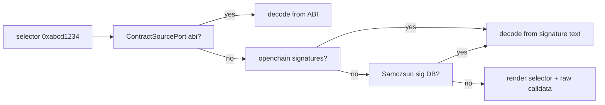

# 4 — Transaction Detail

Status: **done** — MVP Overview + Raw tabs shipped earlier and this
phase extended the screen with ABI-based method decoding, the Logs /
Asset-Changes / State-Changes tabs and pending-tx support. The
Internal-calls tab (Trace namespace) stays explicitly deferred; see
section 12.5.

The most feature-dense screen. Six tabs: Overview, Logs, Internal, State Changes,
Asset Changes, Raw. Heavy reliance on Alchemy's Trace, Debug and Simulation APIs,
plus Etherscan for ABI and openchain / Samczsun for signature fallback.

## 1. Purpose and user goals

- Anatomy of a transaction, successful or reverted.
- Always return a useful view even when ABI / source / signature is missing.
- Produce a decoded, human-readable output whenever possible.

## 2. Layout

```
+-- Breadcrumb -------------------------------------------------+
| ... > Tx 0x8f3c...abcd                                        |
+-- Tabs -------------------------------------------------------+
| [Overview] Logs Internal State-Changes Asset-Changes Raw      |
+-- Content ----------------------------------------------------+
| Hash       0x8f3c...abcd                                      |
| Status     success                                            |
| Block      #21,345,678  (3m 12s ago)                          |
| From       0xd8dA... (vitalik.eth)                            |
| To         0xa0b8... (USDC - ERC20)                           |
| Value      0 ETH                                              |
| Method     transfer(address,uint256)   (from ABI)             |
|              to    0xAbCd...                                  |
|              value 1,000,000,000  (1,000 USDC)                |
| Gas used   52,341 / 80,000    (price 14 gwei)                 |
| Fee paid   0.000732 ETH                                       |
| Type       EIP-1559                                           |
+-- Status bar -------------------------------------------------+
| Tab tabs  y copy hash  s re-simulate  d decode input          |
+---------------------------------------------------------------+
```

Tabs detail:

- **Overview**: top-level metadata plus decoded method call when available.
- **Logs**: each log expanded with decoded event signature and named arguments.
- **Internal**: the call tree as a collapsible outline (`eth_call`, `delegatecall`,
  `staticcall`, `create`, `create2`, `selfdestruct`). Re-use the same renderer as
  the Logs tab.
- **State Changes**: per-address storage diff and balance diff.
- **Asset Changes**: human-readable deltas produced by
  `alchemy_simulateAssetChanges` replay.
- **Raw**: the bare JSON payload (pretty-printed).

## 3. Keybindings

| Key       | Action                                                 |
|-----------|--------------------------------------------------------|
| `Tab`     | Next tab                                               |
| `Shift+T` | Previous tab                                           |
| `y`       | Copy tx hash                                           |
| `s`       | Re-simulate (useful when viewing a pending tx)         |
| `d`       | Open calldata decoder modal                            |
| `Enter`   | On a log or internal call row, open target contract    |
| `o`       | Open "related" menu (block, from, to, contract source) |

## 4. Use cases

### 4.1 `LoadTxOverview`

- **Input**: `TxHash`, chain.
- **Output**: `TxOverview`.
- **Ports**: `TxReaderPort::get(hash)`, `ContractSourcePort::get(addr)`,
  `SignatureDirectoryPort::lookup_selector(bytes4)`.
- **Behaviour**:
  1. Fetch transaction + receipt in parallel (`eth_getTransactionByHash`,
     `eth_getTransactionReceipt`).
  2. Identify `to` as contract or EOA via `eth_getCode`.
  3. If contract, request ABI from Etherscan. If not verified, decode only using the
     function selector via `SignatureDirectoryPort`.
  4. Decode input data: use ABI arguments when available, otherwise show selector +
     raw calldata.
  5. Populate revert reason if status is `0x0`.

### 4.2 `DecodeTxLogs`

- **Input**: receipt logs, chain.
- **Output**: `Vec<DecodedLog>`.
- **Ports**: `ContractSourcePort`, `SignatureDirectoryPort`.
- **Behaviour**: for each log, try ABI decoding first (per log's `address`); fall back
  to openchain event signature database; fall back to Samczsun; otherwise render raw
  topics and data.

### 4.3 `LoadInternalCalls`

- **Input**: `TxHash`, chain.
- **Output**: tree of `InternalCall`.
- **Ports**: `TxTracePort::call_tree(tx_hash)`.
- **Behaviour**: prefer Alchemy `trace_transaction`; if not supported on the active
  chain, fall back to `debug_traceTransaction` with `callTracer`. Map into domain
  tree.

### 4.4 `LoadStateDiff`

- **Input**: `TxHash`, chain.
- **Output**: `StateDiff` keyed by address: balance before/after, storage slots.
- **Ports**: `TxTracePort::replay_state_diff(tx_hash)`.
- **Behaviour**: call `trace_replayTransaction` with `stateDiff`. If the chain does
  not support the trace namespace, return `DomainError::FeatureUnavailable` so the tab
  can display a friendly message.

### 4.5 `LoadAssetChanges`

- **Input**: `TxHash`, chain.
- **Output**: `Vec<AssetChange>` (from, to, asset, raw amount, decimal amount, usd
  when price known).
- **Ports**: `TxSimulationPort::simulate_asset_changes_for_existing_tx`.
- **Behaviour**: rebuild the original tx envelope and call
  `alchemy_simulateAssetChanges` at the parent block; map returned rows into
  `AssetChange`. For pending txs, simulate at latest.

## 5. Ports required

- `TxReaderPort`: `get(hash, chain)`, `receipt(hash, chain)`.
- `TxTracePort`: `call_tree`, `replay_state_diff`.
- `TxSimulationPort`: `simulate_asset_changes_for_existing_tx`,
  `simulate_asset_changes_pending`.
- `ContractSourcePort`: `get_abi(address, chain)`, `get_source(address, chain)`.
- `SignatureDirectoryPort`: `lookup_selector(bytes4)`, `lookup_event_topic(h256)`.

## 6. Data sources

- Alchemy: `eth_getTransactionByHash`, `eth_getTransactionReceipt`,
  `eth_getCode`, `trace_transaction`, `debug_traceTransaction`,
  `trace_replayTransaction`, `alchemy_simulateAssetChanges`.
- Etherscan V2: `getsourcecode`, `getabi`.
- openchain.xyz: `/api/v1/signatures?function=0x...` and `...?event=0x...`.
- Samczsun sig DB: fallback endpoint.

## 7. Signature-decoding fallback chain



The same chain applies to event topics on the Logs tab.

## 8. BDD scenarios (`tests/e2e/features/tx_detail.feature`)

```gherkin
Feature: Transaction detail

  Background:
    Given the active chain is "ethereum"

  Scenario: Successful ERC-20 transfer
    Given the ABI for USDC is available in the Etherscan stub
    When the user opens TxDetail for hash "0x8f3c...abcd"
    Then the Overview tab shows method "transfer(address,uint256)"
    And the decoded arguments include "to" and "value"
    And the Logs tab shows a decoded "Transfer" event

  Scenario: Reverted transaction shows reason
    When the user opens TxDetail for a failed tx
    Then the Overview tab shows status "failed"
    And the revert reason string is displayed

  Scenario: Unknown method selector uses openchain fallback
    Given no ABI is available for the target contract
    And openchain returns "swapExactTokensForTokens(uint256,uint256,address[],address,uint256)" for the selector
    When the user opens TxDetail
    Then the method is displayed using the openchain signature
    And the source is tagged "openchain"

  Scenario: Openchain miss falls back to Samczsun
    Given no ABI is available
    And openchain returns an empty result
    And Samczsun returns "fallback(bytes)" for the selector
    When the user opens TxDetail
    Then the method uses the Samczsun signature

  Scenario: Asset changes tab renders decoded deltas
    Given the simulation stub returns two asset changes
    When the user opens the Asset Changes tab
    Then two rows are displayed with symbol, amount and direction

  Scenario: State diff not supported on the chain
    Given the chain "polygon-zkevm" does not support trace namespace
    When the user opens the State Changes tab for a tx on that chain
    Then the tab shows "State diff not available on this chain"
```

## 9. Functional tests

- `LoadTxOverview`: ABI-based decoding; openchain fallback; Samczsun fallback; no
  signature found still returns a viable overview.
- `DecodeTxLogs`: parametrized over 4 cases (ABI hit, openchain hit, Samczsun hit,
  total miss).
- `LoadInternalCalls`: trace namespace hit; debug namespace fallback; chain with
  neither returns `FeatureUnavailable`.
- `LoadAssetChanges`: existing tx; pending tx at latest; simulation failure mapped
  into domain error.

## 10. Fixtures

- `rpc__eth_getTransactionByHash__usdc_transfer.json`
- `rpc__eth_getTransactionReceipt__usdc_transfer_success.json`
- `rpc__eth_getTransactionReceipt__reverted.json`
- `rpc__trace_transaction__usdc_transfer.json`
- `rpc__debug_traceTransaction__calltracer_usdc_transfer.json`
- `rpc__trace_replayTransaction__stateDiff_usdc_transfer.json`
- `rpc__alchemy_simulateAssetChanges__usdc_transfer.json`
- `etherscan__getabi__usdc.json`
- `openchain__function__0xabcd1234_hit.json`
- `openchain__function__0xabcd1234_miss.json`
- `samczsun__function__0xabcd1234_hit.json`

## 11. Open questions

- Should the Raw tab show the raw JSON from the adapter (useful for debugging) or the
  canonical re-serialized domain entity? Decision: raw adapter response.
- Depth limit for the Internal call tree UI? Default collapse-at-depth=3, expandable
  via `Space`.

## 12. Implementation plan

Delivered in three slices. The MVP intentionally stays narrow so that
the Tx placeholder pushed from BlockDetail and Search becomes a real
screen as quickly as possible; the richer tabs arrive in follow-up
slices once the adapter menagerie (traces, simulation, ABI lookup,
signature directory) is in place.

### 12.1 Slice A — domain + port + use case + stubs (MVP Overview only)

Domain additions (`src/domain/`):

- Extend `tx.rs` with a full `Transaction` entity and the enums it
  pulls in: `TxStatus { Success, Failed { reason: Option<String> } }`
  and `TxType { Legacy, AccessList, DynamicFee, Blob }` (mapped from
  the raw hex type field).
- Transaction fields: `chain`, `hash`, `status`, `block_number`,
  `block_hash`, `tx_index`, `from`, `to` (None for contract creation),
  `value`, `gas_price`, `gas_used`, `gas_limit`, `nonce`, `tx_type`,
  `input` (raw bytes), `raw_json` (exact adapter body to back the Raw
  tab).

Port (`src/application/ports/tx_reader.rs`):

```rust
pub trait TxReaderPort: Send + Sync {
    async fn get(&self, hash: TxHash, chain: Chain)
        -> Result<Option<Transaction>, DomainError>;
}
```

Kept separate from `TxLookupPort` (summary only) for the same reason
`BlockReaderPort` exists next to `BlockLookupPort`: each has a clear
consumer.

Use case (`src/application/use_cases/load_tx_overview.rs`): missing
tx surfaces as `DomainError::NotFound`; otherwise returns the full
`Transaction`.

Stub (`tests/support/stubs.rs::StubTxReaderPort`): in-memory map
keyed by `TxHash`.

Functional tests (`tests/functional/load_tx_overview.rs`):

- happy path (success tx).
- reverted tx carries its reason string.
- missing tx returns `NotFound`.

### 12.2 Slice B — Alchemy adapter

`src/adapters/rpc/tx_reader.rs` exposes `AlchemyTxReader` that issues
`eth_getTransactionByHash` + `eth_getTransactionReceipt` in parallel
with `tokio::join!`, merges the two results and keeps the raw
transaction JSON for the Raw tab. Null response from either call
maps to `Ok(None)`. Revert reason is parsed from the receipt's
`revertReason` field when present (Alchemy exposes it on mined
failed txs); otherwise left as `None` and the UI renders "reverted"
without a reason string.

Tests `tests/functional/alchemy_tx_reader.rs` drive three wiremock
cases: success tx, reverted tx, null result. Fixtures:

- `rpc__eth_getTransactionByHash__usdc_transfer.json`
- `rpc__eth_getTransactionReceipt__usdc_transfer_success.json`
- `rpc__eth_getTransactionReceipt__reverted.json`
- `rpc__eth_getTransactionByHash__null.json`

### 12.3 Slice C — UI and wiring

- `src/adapters/ui/tx_detail.rs` — `TxDetailScreen` with two tabs:
  - **Overview**: hash, status (+ reason if failed), block, from,
    to, value, gas used/price, fee, nonce, type, first 4 bytes of
    input displayed as the hex selector. No ABI decoding yet; the
    line that eventually holds `transfer(address,uint256)` shows the
    raw selector plus a short excerpt of the calldata.
  - **Raw**: pretty-printed JSON from the adapter's stored
    `raw_json`.
- `src/infra/tx_feed.rs` — spawn helper mirroring `block_feed::spawn`:
  owns a `TxReaderPort`, consumes `TxHash` requests, publishes
  `Transaction` values back on the other channel half.
- Wiring in `infra::run`: the Search detail factory now produces a
  `TxDetailScreen` when a `ResolvedEntity::Tx` candidate is
  confirmed, and `BlockDetailScreen`'s `open_tx_factory` produces
  one for each tx-row Enter. Address / Token / Contract kinds keep
  the existing placeholder path.

BDD adjustments in `tests/e2e/features/tx_detail.feature`:

- `Open a successful tx from BlockDetail` — replaces the
  placeholder and asserts the Overview tab shows status "success"
  plus the stub's tx hash.
- `Reverted transaction shows reason` — stub serves a failed
  receipt with a `revertReason`; Overview shows "failed" plus the
  reason text.

The Gherkin scenarios referencing ABI decoding, Logs, Internal,
Asset Changes and State Changes stay in section 8 for reference but
are **not** wired up in this slice.

Acceptance: two new BDD scenarios pass, every previous test stays
green, plan status flipped to `done` (Overview MVP) in
`plan/README.md`, clippy clean.

### 12.4 Expanded slices (delivered in this iteration)

Three commits unlock the bulk of the deferred functionality. The
Internal-calls tab stays out of scope and is tracked in section 12.5.

#### 12.4.1 Commit 1 — Signature directory + Etherscan source

New outbound ports and HTTP adapters:

- `ContractSourcePort::get_abi(address, chain) -> Option<ContractAbi>`
  backed by the Etherscan V2 `module=contract&action=getabi` endpoint
  (`https://api.etherscan.io/v2/api?chainid={id}&...`). Supports every
  EVM chain via the `chainid` query param, per the V2 docs.
- `SignatureDirectoryPort::lookup_selector(bytes4) -> Option<String>`
  and `lookup_event_topic(bytes32) -> Option<String>`, backed by the
  Sourcify 4byte service at `https://api.4byte.sourcify.dev`.
  `openchain.xyz` was the original plan but the user picked Sourcify's
  mirror, which exposes the same 4byte.directory-style schema.

Tests live under `tests/functional/etherscan_contract_source.rs` and
`tests/functional/sourcify_signatures.rs` using wiremock, plus stubs
(`StubContractSourcePort`, `StubSignatureDirectoryPort`) driving
`tests/functional/{decode_selector,decode_event_topic}.rs`.

Config gains `etherscan: Option<String>` under `ApiCredentials`,
sourced from `ETHERSCAN_API_KEY` or the TOML file. When absent, the
Etherscan adapter short-circuits to `Ok(None)` so the rest of the
stack degrades gracefully.

#### 12.4.2 Commit 2 — Pending tx + Logs + ABI method decoding

Domain changes on `Transaction`:

- `block_number`, `block_hash`, `tx_index`, `gas_used` become
  `Option<...>` so pending txs (null receipt, null blockNumber) fit
  the same entity without sentinels.
- New variant `TxStatus::Pending` shipped alongside
  `Success | Failed { reason }`.
- New field `logs: Vec<LogEntry>` mirroring the raw receipt logs.

New types `DecodedMethod { signature, source }`, `DecodedLog
{ signature, source, topics, data }`, and a composite `TxView`
returned by `load_tx_overview`: it stays thin and just enriches the
existing `Transaction` with the decoded method and the decoded logs
(best-effort: ABI first, signature directory fallback, raw selector /
topic0 last).

`AlchemyTxReader` is extended to:
- capture receipt logs into `Transaction.logs`,
- handle a null `blockNumber` / null receipt by marking the tx as
  `TxStatus::Pending` and leaving block-level fields at `None`.

UI: `TxDetailScreen` gains a **Logs** tab rendered from
`decoded_logs`, and the Overview `Method` line now shows the
decoded signature + source tag (`from ABI`, `from sigdb`, or
`unknown`). Tab cycle becomes `Overview → Logs → Raw` (`Asset
Changes` and `State Changes` land in commit 3).

BDD additions in `tests/e2e/features/tx_detail.feature`:
- `Overview decodes the method via ABI`.
- `Logs tab shows decoded event signatures`.
- `Pending transaction is handled`.

#### 12.4.3 Commit 3 — Asset Changes + State Changes

New ports and Alchemy adapters:

- `TxSimulationPort::asset_changes(tx_input, chain)` using
  `alchemy_simulateAssetChanges`.
- `TxTracePort::state_diff(tx_hash, chain)` using
  `trace_replayTransaction` with `["stateDiff"]`.

Both inject results into the enriched `TxView`; the UI adds two tabs
(`Asset Changes`, `State Changes`), each with an "unsupported on this
chain" fallback when the underlying call returns
`DomainError::FeatureUnavailable`.

BDD additions:
- `Asset Changes tab renders decoded deltas`.
- `State Changes tab renders storage and balance diffs`.
- `State Changes degrades gracefully on a chain without trace_`.

### 12.5 Still deferred

1. Internal-calls tab (Trace / Debug namespace): needs a recursive
   call-tree domain type + collapsible outline widget; worth a
   dedicated plan entry when prioritised.
2. Argument-level ABI decoding of calldata on the Overview tab
   (currently we show the signature text only; showing the decoded
   argument values requires a proper ABI decoder — shipping a
   minimal subset later).
3. `s` re-simulate key on pending txs: the pending screen renders
   correctly but the key is bound to a no-op until the simulation
   path is extended to re-run against the latest block on demand.
