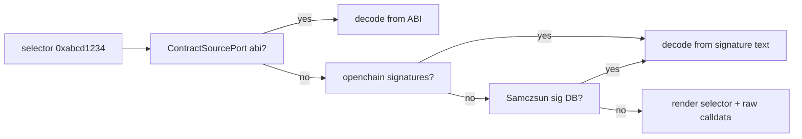

# 4 — Transaction Detail

Status: **done (MVP) / follow-up in progress** — MVP Overview + Raw
tabs shipped earlier and this phase extended the screen with
ABI-based method decoding, the Logs / Asset-Changes / State-Changes
tabs and pending-tx support. A new follow-up iteration (see
section 13) tightens the UX: row-level copy on Overview, humanized
gas/fee values, bounded scrolling project-wide, interactive Logs
tab with ABI-decoded field copy, and `Shift+Tab` / arrow-key tab
navigation project-wide. The Internal-calls tab (Trace namespace)
stays explicitly deferred; see section 12.5.

The most feature-dense screen. Six tabs: Overview, Logs, Internal, State Changes,
Asset Changes, Raw. Heavy reliance on Alchemy's Trace, Debug and Simulation APIs,
plus Etherscan for ABI and openchain / Samczsun for signature fallback.

## 1. Purpose and user goals

- Anatomy of a transaction, successful or reverted.
- Always return a useful view even when ABI / source / signature is missing.
- Produce a decoded, human-readable output whenever possible.

## 2. Layout

```
+-- Breadcrumb -------------------------------------------------+
| ... > Tx 0x8f3c...abcd                                        |
+-- Tabs -------------------------------------------------------+
| [Overview] Logs Internal State-Changes Asset-Changes Raw      |
+-- Content ----------------------------------------------------+
| Hash       0x8f3c...abcd                                      |
| Status     success                                            |
| Block      #21,345,678  (3m 12s ago)                          |
| From       0xd8dA... (vitalik.eth)                            |
| To         0xa0b8... (USDC - ERC20)                           |
| Value      0 ETH                                              |
| Method     transfer(address,uint256)   (from ABI)             |
|              to    0xAbCd...                                  |
|              value 1,000,000,000  (1,000 USDC)                |
| Gas used   52,341 / 80,000    (price 14 gwei)                 |
| Fee paid   0.000732 ETH                                       |
| Type       EIP-1559                                           |
+-- Status bar -------------------------------------------------+
| Tab tabs  y copy hash  s re-simulate  d decode input          |
+---------------------------------------------------------------+
```

Tabs detail:

- **Overview**: top-level metadata plus decoded method call when available.
- **Logs**: each log expanded with decoded event signature and named arguments.
- **Internal**: the call tree as a collapsible outline (`eth_call`, `delegatecall`,
  `staticcall`, `create`, `create2`, `selfdestruct`). Re-use the same renderer as
  the Logs tab.
- **State Changes**: per-address storage diff and balance diff.
- **Asset Changes**: human-readable deltas produced by
  `alchemy_simulateAssetChanges` replay.
- **Raw**: the bare JSON payload (pretty-printed).

## 3. Keybindings

| Key            | Action                                                    |
|----------------|-----------------------------------------------------------|
| `Tab`          | Next tab                                                  |
| `Shift+Tab`    | Previous tab (project-wide, see 13.5)                     |
| `Right`/`Left` | Switch tabs when no focused widget consumes the arrow key |
| `Up`/`Down`    | Move the in-tab selection cursor (Overview 13.1, Logs 13.4) |
| `y`            | Copy the selected row / field's canonical value (13.1)    |
| `s`            | Re-simulate (useful when viewing a pending tx)            |
| `d`            | Open calldata decoder modal                               |
| `Enter`        | On a log or internal call row, open target contract       |
| `o`            | Open "related" menu (block, from, to, contract source)    |

## 4. Use cases

### 4.1 `LoadTxOverview`

- **Input**: `TxHash`, chain.
- **Output**: `TxOverview`.
- **Ports**: `TxReaderPort::get(hash)`, `ContractSourcePort::get(addr)`,
  `SignatureDirectoryPort::lookup_selector(bytes4)`.
- **Behaviour**:
  1. Fetch transaction + receipt in parallel (`eth_getTransactionByHash`,
     `eth_getTransactionReceipt`).
  2. Identify `to` as contract or EOA via `eth_getCode`.
  3. If contract, request ABI from Etherscan. If not verified, decode only using the
     function selector via `SignatureDirectoryPort`.
  4. Decode input data: use ABI arguments when available, otherwise show selector +
     raw calldata.
  5. Populate revert reason if status is `0x0`.

### 4.2 `DecodeTxLogs`

- **Input**: receipt logs, chain.
- **Output**: `Vec<DecodedLog>`.
- **Ports**: `ContractSourcePort`, `SignatureDirectoryPort`.
- **Behaviour**: for each log, try ABI decoding first (per log's `address`); fall back
  to openchain event signature database; fall back to Samczsun; otherwise render raw
  topics and data.

### 4.3 `LoadInternalCalls`

- **Input**: `TxHash`, chain.
- **Output**: tree of `InternalCall`.
- **Ports**: `TxTracePort::call_tree(tx_hash)`.
- **Behaviour**: prefer Alchemy `trace_transaction`; if not supported on the active
  chain, fall back to `debug_traceTransaction` with `callTracer`. Map into domain
  tree.

### 4.4 `LoadStateDiff`

- **Input**: `TxHash`, chain.
- **Output**: `StateDiff` keyed by address: balance before/after, storage slots.
- **Ports**: `TxTracePort::replay_state_diff(tx_hash)`.
- **Behaviour**: call `trace_replayTransaction` with `stateDiff`. If the chain does
  not support the trace namespace, return `DomainError::FeatureUnavailable` so the tab
  can display a friendly message.

### 4.5 `LoadAssetChanges`

- **Input**: `TxHash`, chain.
- **Output**: `Vec<AssetChange>` (from, to, asset, raw amount, decimal amount, usd
  when price known).
- **Ports**: `TxSimulationPort::simulate_asset_changes_for_existing_tx`.
- **Behaviour**: rebuild the original tx envelope and call
  `alchemy_simulateAssetChanges` at the parent block; map returned rows into
  `AssetChange`. For pending txs, simulate at latest.

## 5. Ports required

- `TxReaderPort`: `get(hash, chain)`, `receipt(hash, chain)`.
- `TxTracePort`: `call_tree`, `replay_state_diff`.
- `TxSimulationPort`: `simulate_asset_changes_for_existing_tx`,
  `simulate_asset_changes_pending`.
- `ContractSourcePort`: `get_abi(address, chain)`, `get_source(address, chain)`.
- `SignatureDirectoryPort`: `lookup_selector(bytes4)`, `lookup_event_topic(h256)`.

## 6. Data sources

- Alchemy: `eth_getTransactionByHash`, `eth_getTransactionReceipt`,
  `eth_getCode`, `trace_transaction`, `debug_traceTransaction`,
  `trace_replayTransaction`, `alchemy_simulateAssetChanges`.
- Etherscan V2: `getsourcecode`, `getabi`.
- openchain.xyz: `/api/v1/signatures?function=0x...` and `...?event=0x...`.
- Samczsun sig DB: fallback endpoint.

## 7. Signature-decoding fallback chain



The same chain applies to event topics on the Logs tab.

## 8. BDD scenarios (`tests/e2e/features/tx_detail.feature`)

```gherkin
Feature: Transaction detail

  Background:
    Given the active chain is "ethereum"

  Scenario: Successful ERC-20 transfer
    Given the ABI for USDC is available in the Etherscan stub
    When the user opens TxDetail for hash "0x8f3c...abcd"
    Then the Overview tab shows method "transfer(address,uint256)"
    And the decoded arguments include "to" and "value"
    And the Logs tab shows a decoded "Transfer" event

  Scenario: Reverted transaction shows reason
    When the user opens TxDetail for a failed tx
    Then the Overview tab shows status "failed"
    And the revert reason string is displayed

  Scenario: Unknown method selector uses openchain fallback
    Given no ABI is available for the target contract
    And openchain returns "swapExactTokensForTokens(uint256,uint256,address[],address,uint256)" for the selector
    When the user opens TxDetail
    Then the method is displayed using the openchain signature
    And the source is tagged "openchain"

  Scenario: Openchain miss falls back to Samczsun
    Given no ABI is available
    And openchain returns an empty result
    And Samczsun returns "fallback(bytes)" for the selector
    When the user opens TxDetail
    Then the method uses the Samczsun signature

  Scenario: Asset changes tab renders decoded deltas
    Given the simulation stub returns two asset changes
    When the user opens the Asset Changes tab
    Then two rows are displayed with symbol, amount and direction

  Scenario: State diff not supported on the chain
    Given the chain "polygon-zkevm" does not support trace namespace
    When the user opens the State Changes tab for a tx on that chain
    Then the tab shows "State diff not available on this chain"
```

## 9. Functional tests

- `LoadTxOverview`: ABI-based decoding; openchain fallback; Samczsun fallback; no
  signature found still returns a viable overview.
- `DecodeTxLogs`: parametrized over 4 cases (ABI hit, openchain hit, Samczsun hit,
  total miss).
- `LoadInternalCalls`: trace namespace hit; debug namespace fallback; chain with
  neither returns `FeatureUnavailable`.
- `LoadAssetChanges`: existing tx; pending tx at latest; simulation failure mapped
  into domain error.

## 10. Fixtures

- `rpc__eth_getTransactionByHash__usdc_transfer.json`
- `rpc__eth_getTransactionReceipt__usdc_transfer_success.json`
- `rpc__eth_getTransactionReceipt__reverted.json`
- `rpc__trace_transaction__usdc_transfer.json`
- `rpc__debug_traceTransaction__calltracer_usdc_transfer.json`
- `rpc__trace_replayTransaction__stateDiff_usdc_transfer.json`
- `rpc__alchemy_simulateAssetChanges__usdc_transfer.json`
- `etherscan__getabi__usdc.json`
- `openchain__function__0xabcd1234_hit.json`
- `openchain__function__0xabcd1234_miss.json`
- `samczsun__function__0xabcd1234_hit.json`

## 11. Open questions

- Should the Raw tab show the raw JSON from the adapter (useful for debugging) or the
  canonical re-serialized domain entity? Decision: raw adapter response.
- Depth limit for the Internal call tree UI? Default collapse-at-depth=3, expandable
  via `Space`.

## 12. Implementation plan

Delivered in three slices. The MVP intentionally stays narrow so that
the Tx placeholder pushed from BlockDetail and Search becomes a real
screen as quickly as possible; the richer tabs arrive in follow-up
slices once the adapter menagerie (traces, simulation, ABI lookup,
signature directory) is in place.

### 12.1 Slice A — domain + port + use case + stubs (MVP Overview only)

Domain additions (`src/domain/`):

- Extend `tx.rs` with a full `Transaction` entity and the enums it
  pulls in: `TxStatus { Success, Failed { reason: Option<String> } }`
  and `TxType { Legacy, AccessList, DynamicFee, Blob }` (mapped from
  the raw hex type field).
- Transaction fields: `chain`, `hash`, `status`, `block_number`,
  `block_hash`, `tx_index`, `from`, `to` (None for contract creation),
  `value`, `gas_price`, `gas_used`, `gas_limit`, `nonce`, `tx_type`,
  `input` (raw bytes), `raw_json` (exact adapter body to back the Raw
  tab).

Port (`src/application/ports/tx_reader.rs`):

```rust
pub trait TxReaderPort: Send + Sync {
    async fn get(&self, hash: TxHash, chain: Chain)
        -> Result<Option<Transaction>, DomainError>;
}
```

Kept separate from `TxLookupPort` (summary only) for the same reason
`BlockReaderPort` exists next to `BlockLookupPort`: each has a clear
consumer.

Use case (`src/application/use_cases/load_tx_overview.rs`): missing
tx surfaces as `DomainError::NotFound`; otherwise returns the full
`Transaction`.

Stub (`tests/support/stubs.rs::StubTxReaderPort`): in-memory map
keyed by `TxHash`.

Functional tests (`tests/functional/load_tx_overview.rs`):

- happy path (success tx).
- reverted tx carries its reason string.
- missing tx returns `NotFound`.

### 12.2 Slice B — Alchemy adapter

`src/adapters/rpc/tx_reader.rs` exposes `AlchemyTxReader` that issues
`eth_getTransactionByHash` + `eth_getTransactionReceipt` in parallel
with `tokio::join!`, merges the two results and keeps the raw
transaction JSON for the Raw tab. Null response from either call
maps to `Ok(None)`. Revert reason is parsed from the receipt's
`revertReason` field when present (Alchemy exposes it on mined
failed txs); otherwise left as `None` and the UI renders "reverted"
without a reason string.

Tests `tests/functional/alchemy_tx_reader.rs` drive three wiremock
cases: success tx, reverted tx, null result. Fixtures:

- `rpc__eth_getTransactionByHash__usdc_transfer.json`
- `rpc__eth_getTransactionReceipt__usdc_transfer_success.json`
- `rpc__eth_getTransactionReceipt__reverted.json`
- `rpc__eth_getTransactionByHash__null.json`

### 12.3 Slice C — UI and wiring

- `src/adapters/ui/tx_detail.rs` — `TxDetailScreen` with two tabs:
  - **Overview**: hash, status (+ reason if failed), block, from,
    to, value, gas used/price, fee, nonce, type, first 4 bytes of
    input displayed as the hex selector. No ABI decoding yet; the
    line that eventually holds `transfer(address,uint256)` shows the
    raw selector plus a short excerpt of the calldata.
  - **Raw**: pretty-printed JSON from the adapter's stored
    `raw_json`.
- `src/infra/tx_feed.rs` — spawn helper mirroring `block_feed::spawn`:
  owns a `TxReaderPort`, consumes `TxHash` requests, publishes
  `Transaction` values back on the other channel half.
- Wiring in `infra::run`: the Search detail factory now produces a
  `TxDetailScreen` when a `ResolvedEntity::Tx` candidate is
  confirmed, and `BlockDetailScreen`'s `open_tx_factory` produces
  one for each tx-row Enter. Address / Token / Contract kinds keep
  the existing placeholder path.

BDD adjustments in `tests/e2e/features/tx_detail.feature`:

- `Open a successful tx from BlockDetail` — replaces the
  placeholder and asserts the Overview tab shows status "success"
  plus the stub's tx hash.
- `Reverted transaction shows reason` — stub serves a failed
  receipt with a `revertReason`; Overview shows "failed" plus the
  reason text.

The Gherkin scenarios referencing ABI decoding, Logs, Internal,
Asset Changes and State Changes stay in section 8 for reference but
are **not** wired up in this slice.

Acceptance: two new BDD scenarios pass, every previous test stays
green, plan status flipped to `done` (Overview MVP) in
`plan/README.md`, clippy clean.

### 12.4 Expanded slices (delivered in this iteration)

Three commits unlock the bulk of the deferred functionality. The
Internal-calls tab stays out of scope and is tracked in section 12.5.

#### 12.4.1 Commit 1 — Signature directory + Etherscan source

New outbound ports and HTTP adapters:

- `ContractSourcePort::get_abi(address, chain) -> Option<ContractAbi>`
  backed by the Etherscan V2 `module=contract&action=getabi` endpoint
  (`https://api.etherscan.io/v2/api?chainid={id}&...`). Supports every
  EVM chain via the `chainid` query param, per the V2 docs.
- `SignatureDirectoryPort::lookup_selector(bytes4) -> Option<String>`
  and `lookup_event_topic(bytes32) -> Option<String>`, backed by the
  Sourcify 4byte service at `https://api.4byte.sourcify.dev`.
  `openchain.xyz` was the original plan but the user picked Sourcify's
  mirror, which exposes the same 4byte.directory-style schema.

Tests live under `tests/functional/etherscan_contract_source.rs` and
`tests/functional/sourcify_signatures.rs` using wiremock, plus stubs
(`StubContractSourcePort`, `StubSignatureDirectoryPort`) driving
`tests/functional/{decode_selector,decode_event_topic}.rs`.

Config gains `etherscan: Option<String>` under `ApiCredentials`,
sourced from `ETHERSCAN_API_KEY` or the TOML file. When absent, the
Etherscan adapter short-circuits to `Ok(None)` so the rest of the
stack degrades gracefully.

#### 12.4.2 Commit 2 — Pending tx + Logs + ABI method decoding

Domain changes on `Transaction`:

- `block_number`, `block_hash`, `tx_index`, `gas_used` become
  `Option<...>` so pending txs (null receipt, null blockNumber) fit
  the same entity without sentinels.
- New variant `TxStatus::Pending` shipped alongside
  `Success | Failed { reason }`.
- New field `logs: Vec<LogEntry>` mirroring the raw receipt logs.

New types `DecodedMethod { signature, source }`, `DecodedLog
{ signature, source, topics, data }`, and a composite `TxView`
returned by `load_tx_overview`: it stays thin and just enriches the
existing `Transaction` with the decoded method and the decoded logs
(best-effort: ABI first, signature directory fallback, raw selector /
topic0 last).

`AlchemyTxReader` is extended to:
- capture receipt logs into `Transaction.logs`,
- handle a null `blockNumber` / null receipt by marking the tx as
  `TxStatus::Pending` and leaving block-level fields at `None`.

UI: `TxDetailScreen` gains a **Logs** tab rendered from
`decoded_logs`, and the Overview `Method` line now shows the
decoded signature + source tag (`from ABI`, `from sigdb`, or
`unknown`). Tab cycle becomes `Overview → Logs → Raw` (`Asset
Changes` and `State Changes` land in commit 3).

BDD additions in `tests/e2e/features/tx_detail.feature`:
- `Overview decodes the method via ABI`.
- `Logs tab shows decoded event signatures`.
- `Pending transaction is handled`.

#### 12.4.3 Commit 3 — Asset Changes + State Changes

New ports and Alchemy adapters:

- `TxSimulationPort::asset_changes(tx_input, chain)` using
  `alchemy_simulateAssetChanges`.
- `TxTracePort::state_diff(tx_hash, chain)` using
  `trace_replayTransaction` with `["stateDiff"]`.

Both inject results into the enriched `TxView`; the UI adds two tabs
(`Asset Changes`, `State Changes`), each with an "unsupported on this
chain" fallback when the underlying call returns
`DomainError::FeatureUnavailable`.

BDD additions:
- `Asset Changes tab renders decoded deltas`.
- `State Changes tab renders storage and balance diffs`.
- `State Changes degrades gracefully on a chain without trace_`.

### 12.5 Still deferred

1. Internal-calls tab (Trace / Debug namespace): needs a recursive
   call-tree domain type + collapsible outline widget; worth a
   dedicated plan entry when prioritised. **Partially shipped** in
   §12.6.5 below: the `TxTracePort::call_tree` method, the
   `CallNode` domain type and the Alchemy adapter plumbing landed,
   but the UI tab is still pending wider terminal testing before
   it is wired into `TxTab`.
2. Argument-level ABI decoding of calldata on the Overview tab
   (currently we show the signature text only; showing the decoded
   argument values requires a proper ABI decoder — shipping a
   minimal subset later). **Shipped for logs** in §12.6.4 below:
   when the decoding cascade resolves a signature through the ABI
   path, the Logs tab now honours the real indexed/non-indexed
   flags from the ABI entry instead of guessing from a canonical
   ERC20/ERC721 shape.
3. `s` re-simulate key on pending txs: the pending screen renders
   correctly but the key is bound to a no-op until the simulation
   path is extended to re-run against the latest block on demand.
   **Shipped** in §12.6.3 below.
4. In the overview tab, show the function called, the parameters
   passed, and the snippet of the implementation of the evoked
   funtion
5. the "asset changes" tab should show ERC20 transfers and native
    tokens transfers.

### 12.6 Follow-up iteration (probe/8.5) — shipped in April 2026

Branch `probe/8.5-tx-detail-followups` lands the five deferred items
tracked under `plan/15-backlog.md` section 8.5. Each sub-section
below documents the final shape of the slice it ships.

#### 12.6.1 Overview tab never waits on slow RPC methods (item 5)

**Scope**: `load_tx_overview::run_with_decoding`,
`infra::tx_feed::spawn_full`, `tests/functional/load_tx_overview.rs`,
`tests/e2e/features/tx_detail.feature`.

The Overview view-model is populated strictly from
`eth_getTransactionByHash` + `eth_getTransactionReceipt` (the
`TxReaderPort::get` method) plus Etherscan ABI + signature
directory lookups. None of the decoding cascade touches the
trace / debug namespace.

`TxFeedSender::spawn_full` emits two updates per request:

1. A **base view** built from `run_with_decoding` (reader + ABI +
   signature directory). This reaches the UI the moment the reader
   resolves, regardless of how slow the tracer / simulator is.
2. An **enriched view** where `asset_changes` and `state_diff` have
   moved from `Pending` to `Loaded { .. } | Unsupported | Failed`.
   Both tracer and simulator run concurrently via `tokio::join!`,
   so their latencies no longer compound.

Functional tests use a `SlowStubTxTracePort` / `SlowStubTxSimulationPort`
wrapper in `tests/support/stubs.rs` that holds each call for a
caller-controlled duration; the test asserts the first channel
update arrives before the tracer stub has fired.

BDD: `Scenario: Overview renders before trace finishes`.

#### 12.6.2 Minor dependency on base view delivery

The above split means `LoadStatus::Pending` is the canonical initial
state for `asset_changes` and `state_diff`. The screen renders the
"Simulating asset changes..." / "Replaying transaction for state
diff..." hints during that window, so the user sees *something* on
those tabs even while the tracer / simulator is still in flight.

#### 12.6.3 `s` re-simulate on pending tx (item 3)

**Scope**: `TxDetailScreen::handle_key`, `tests/functional/tx_detail_screen_keys.rs`,
`tests/e2e/features/tx_detail.feature`.

`s` binding:

- On a **pending** tx (`TxStatus::Pending`), resends the tx hash on
  the feed's `input_tx` channel. The background task re-runs
  `run_with_decoding` + the simulator/tracer join — the same code
  path used on initial load — so the Asset Changes and State
  Changes tabs refresh against the latest block.
- On a **mined** tx, the binding is a no-op: the screen exposes
  `last_resimulate_count()` as zero so the functional test can pin
  the behaviour.

The hook deliberately stays inside the screen: the re-fetch request
is just another message on the existing `TxFeed::input_tx`
channel, so we don't need a new port or a new command variant.

BDD: `Scenario: Pressing s on a pending tx refetches asset changes`.

#### 12.6.4 ABI-driven argument decoding on the Logs tab (item 2)

**Scope**: `src/application/tx_view.rs::{DecodedSignature, DecodedLog}`,
`src/application/use_cases/load_tx_overview.rs`,
`src/adapters/ui/tx_detail.rs`,
`tests/functional/load_tx_overview.rs`,
`tests/fixtures/*`.

`DecodedSignature` grows an optional
`parsed: Option<EventAbi>` payload where

```rust
pub struct EventAbi {
    pub name: String,
    pub params: Vec<EventParamAbi>,
}

pub struct EventParamAbi {
    pub name: String,
    pub type_: String,
    pub indexed: bool,
}
```

is populated only when the cascade resolves through an ABI
entry (direct ABI or proxy-implementation ABI). Signature-directory
hits leave it `None`: the 4byte mirror cannot tell indexed apart
from non-indexed, so the UI falls back to the existing "first N
positional types are indexed" heuristic for those.

When `parsed` is `Some`, the Logs tab aligns `topics[1..]` onto the
`params.iter().filter(|p| p.indexed)` sequence in ABI order, and
`data` 32-byte words onto `params.iter().filter(|p| !p.indexed)`.
The fallback heuristic is kept intact for signature-directory hits
and non-standard events.

Functional tests in `tests/functional/load_tx_overview.rs` cover:

- ERC721 `Transfer(address indexed from, address indexed to, uint256 indexed tokenId)` — all three topics indexed.
- ERC20 `Transfer(address indexed from, address indexed to, uint256 value)` — two indexed, one data word.
- Custom event with mixed indexed / non-indexed ordering
  (e.g. `Ping(uint256 indexed id, string message, address indexed who)`)
  to prove that the ABI parameter order is preserved rather than
  assumed to be "indexed first".

#### 12.6.5 Internal-calls port + Alchemy adapter (item 1)

**Scope**: `src/domain/tx_trace.rs`, `src/application/ports/tx_trace.rs`,
`src/adapters/rpc/tx_trace.rs`,
`tests/functional/alchemy_tx_trace.rs`, fixtures.

New domain type:

```rust
pub struct CallNode {
    pub from: Address,
    pub to: Option<Address>,
    pub value: Wei,
    pub input: Vec<u8>,
    pub output: Vec<u8>,
    pub kind: CallKind, // Call | Create | Create2 | Staticcall | Delegatecall | Callcode | Selfdestruct
    pub gas_used: u64,
    pub error: Option<String>,
    pub children: Vec<CallNode>,
}
```

New port method on `TxTracePort`:

```rust
async fn call_tree(&self, hash: TxHash, chain: Chain)
    -> Result<CallNode, DomainError>;
```

`AlchemyTxTracer::call_tree` first tries `trace_transaction` (Parity
namespace), mapping its flat frame array into the tree via
`trace_address`; when that returns `-32601` (method not found), it
falls back to `debug_traceTransaction` with
`{"tracer": "callTracer"}`, which already returns a tree.

Fixtures:

- `alchemy__trace_transaction__usdc_transfer.json` (parity happy path).
- `alchemy__trace_transaction__method_not_found.json` (forces fallback).
- `alchemy__debug_trace_calltracer__usdc_transfer.json` (debug happy path).
- `alchemy__debug_trace_calltracer__unsupported.json` (both unsupported).

#### 12.6.6 ContractDetail scroll cursors migrated to ScrollState (item 4)

**Scope**: `src/adapters/ui/contract_detail.rs`,
`src/adapters/ui/scroll.rs`.

`ContractDetailScreen` now keeps its Overview / ABI / Events /
Storage / Source scroll offsets in a shared `Cell<ScrollState>`,
replacing the `scroll: u16` + `scroll_cap: Cell<u16>` pair. The
Source tab retains its own file-picker `ListState`; the content
paragraph uses `ScrollState` like every other scrollable body.

Both `handle_key` and the tab-switch path route through
`scroll.reset()` when the tab changes, mirroring `TxDetailScreen`.
`set_dimensions` is called from every `render_*` helper so the clamp
is always live. Behaviour does not change for the user; this is
strictly a consistency / correctness refactor that eliminates one
more place where the scroll cursor could drift past the visible
content (plan 13.3).

## 13. Follow-up fixes

Status: **done** for 13.1, 13.2, 13.4, 13.5. **Partially done** for
13.3 (tx-detail uses the full `ScrollState` helper with bounded
scroll; contract-detail and address-detail use the lighter
`scroll_cap: Cell<u16>` clamp strategy — see the "Deferred" bullet
at the end of 13.3).

Five refinements requested after the MVP shipped. Items marked
**(project-wide)** are not tx-detail-specific and must be applied
consistently across every screen in the app; they live here because
they were surfaced while reviewing the tx-detail screen but the fix
belongs to the shared screen / input infrastructure.

### 13.1 Overview tab — selectable / copyable field values (done)

**Scope**: `TxDetailScreen` Overview tab.

Problem: the Overview tab is currently pure static render. There is
no way to move a selection through its rows, so the user cannot copy
individual values (hash, from, to, block hash, raw input selector,
revert reason, etc.) — only the hash, via the global `y` key.

Design:

- Add a row-level selection cursor to the Overview tab. Arrow keys
  `Up` / `Down` (and `k` / `j`) move the cursor between the
  information rows. Non-selectable rows (section separators, empty
  lines) are skipped.
- The currently selected row is highlighted using
  `Theme::selection_bg`, matching the selection style used on list
  screens (Blocks, Mempool, Address tx list).
- `y` copies the selected row's canonical value (not the rendered
  label) via the existing `ClipboardPort`. Fallback to "hash" only
  when no row is selected (back-compat with the current binding).
- Each selectable row declares a `copy_value: String` in the
  Overview view-model, independent of the displayed label. For
  example the `Fee paid` row displays a humanized value but copies
  the exact wei string (see 13.2).
- Status bar hint updates: `↑↓ select  y copy value  Tab next tab`.

Acceptance:

- Pressing `Up` / `Down` moves through the rows and loops at the
  edges.
- With `From` selected, `y` copies the full 0x-prefixed address.
- With `Fee paid` selected, `y` copies the raw wei amount.
- Snapshot test via `TestBackend` verifies the highlighted row
  bookkeeping.
- At least one BDD scenario: `Overview tab lets the user copy the
  From address`.

### 13.2 Humanized gas / fee values with inline raw hint (done)

**Scope**: `TxDetailScreen` Overview tab + new formatting helpers in
`src/adapters/ui/format.rs`.

Problem: `Gas used`, `Gas price`, `Fee paid` and `Value` currently
render raw `Wei` / `Gwei` numbers. The user wants humanized values
(ETH with 4 significant digits for fee / value, gwei for gas price,
plain thousands-grouped integer for gas used) and, **only when the
selection cursor from 13.1 is on that row**, the exact raw wei /
gwei value rendered to the right of the humanized label in
`Theme::text_muted` (gray).

Design:

- New formatters in `src/adapters/ui/format.rs`:
  - `humanize_eth(wei: Wei) -> String` — strips trailing zeros,
    keeps up to 6 decimals, thousands-grouped integer part.
  - `humanize_gwei(wei: Wei) -> String` — rendered in gwei with at
    most 4 decimals.
  - `humanize_gas_units(gas: u64) -> String` — thousands-grouped
    (`52,341`).
- Overview row rendering uses `Line::from` spans: the primary span
  is the humanized string; when the row is selected, a second
  muted span is appended: `  (raw: 732145679812 wei)`.
- The raw hint is never shown on unselected rows, so the baseline
  layout is unchanged.
- Formatting is pure; unit tests live in
  `tests/unit/format.rs` covering edge cases (zero, <1 gwei,
  exact round numbers, non-round decimals).

Acceptance:

- `Fee paid` renders as `0.000732 ETH` by default and as
  `0.000732 ETH    raw: 732000000000 wei` when selected.
- `Gas used` renders with thousands separators.
- `Gas price` renders in gwei.
- Unit test matrix covers at least 8 inputs per formatter.

### 13.3 Bounded scrolling on all scrollable screens **(project-wide, partially done)**

**Scope**: every `Screen` that maintains a vertical scroll offset
(tx-detail Overview / Logs / Raw / Asset / State, block-detail tx
list, address tx list, mempool, contract Read tab, token holders,
etc.). Implementation lives in a shared `Scrollable` helper under
`src/adapters/ui/scroll.rs`.

Problems:

1. Screens whose content already fits inside the visible area still
   accept scroll input and move the `scroll_offset` past zero /
   below zero, producing a visibly blank render.
2. Screens whose content overflows allow scrolling past the end of
   the content, so the user ends up staring at an empty viewport
   after the last row.

Design:

- Shared helper:

  ```rust
  pub struct ScrollState {
      offset: u16,
      content_height: u16,
      viewport_height: u16,
  }

  impl ScrollState {
      pub fn scroll_by(&mut self, delta: i32);
      pub fn max_offset(&self) -> u16 {
          self.content_height.saturating_sub(self.viewport_height)
      }
      pub fn is_scrollable(&self) -> bool {
          self.content_height > self.viewport_height
      }
  }
  ```

- `scroll_by` clamps `offset` to `0..=max_offset()`. When
  `is_scrollable()` is `false`, all scroll inputs are dropped
  (returning `None` so the dispatcher does not mark the frame
  dirty).
- Every screen that today keeps a `scroll: u16` field migrates to
  a `ScrollState`, computing `content_height` from its
  view-model and `viewport_height` from the rendered `Rect`.
- Page-up / page-down / home / end also go through `ScrollState`
  to inherit the clamping.

Acceptance:

- On a tx with a single short log, pressing `PageDown` does
  nothing (no flicker, scroll stays at 0).
- On a tx with many logs, pressing `PageDown` repeatedly stops
  when the last log is anchored to the last visible row (no blank
  tail).
- Unit tests for `ScrollState` cover: zero content, content
  shorter than viewport, content exactly equal to viewport,
  content longer than viewport, delta larger than bounds in
  either direction.
- BDD scenario on `tx_detail.feature`:
  `Scrolling the Logs tab stops at the last log row`.

Delivered:
- New shared helper `src/adapters/ui/scroll.rs::ScrollState` with
  9 unit tests covering every clamping edge case.
- `TxDetailScreen` fully migrated: scroll state wrapped in
  `Cell<ScrollState>`, content/viewport dimensions refreshed on
  each render, `handle_key` clamps through the helper. Applies to
  Overview / Logs / Asset Changes / State Changes / Raw.
- `ContractDetailScreen` and `AddressDetailScreen` migrated to the
  lighter `scroll_cap: Cell<u16>` strategy: render computes the
  upper bound from the body line count and the viewport, and
  `handle_key` clamps `self.scroll` against that cap.

Deferred (tracked as a follow-up):
- Full migration of `ContractDetailScreen`'s Source / Read /
  Events / Storage scroll cursors to `ScrollState` (the
  `scroll_cap` clamp fixes the "blank viewport after the end"
  problem for every tab, but the Source tab still keeps its own
  file-picker scroll semantics).
- Adding a dedicated BDD scenario
  (`Scrolling the Logs tab stops at the last log row`) — the
  behaviour is covered by the `ScrollState` unit tests and
  indirectly by the existing tx-detail scenarios; a standalone
  scenario would need a new rendering fixture.

### 13.4 Logs tab — interactive navigation and ABI-decoded values (done)

**Scope**: `TxDetailScreen` Logs tab.

Problem: the Logs tab today renders each log as a static paragraph.
The user needs to:

- Pick which log to inspect (multiple logs per tx).
- Navigate inside a log across its decoded fields (topic0 / event
  signature, indexed arguments per topic, decoded data arguments).
- Copy a selected field's canonical value.
- See ABI-decoded values for topics and data, falling back to raw
  hex — with the raw hex shown to the right in gray when the
  decoded value is selected (mirrors 13.2).

Design:

- Two-pane layout inside the Logs tab:
  - **Left**: list of logs (one line per log, summary =
    `#index  Event(...)` or `#index  0xtopic0`).
  - **Right**: detail view of the currently highlighted log, with
    its own row-level cursor traversing `event signature`,
    `topic[1]..topic[3]` (indexed args), and each decoded data
    argument.
- Decoding path uses the existing `DecodeTxLogs` use case. The
  `TxView` already carries `decoded_logs: Vec<DecodedLog>`; we
  extend `DecodedLog` with `fields: Vec<DecodedField>` where:

  ```rust
  pub struct DecodedField {
      pub name: String,
      pub kind: AbiKind,
      pub value: DecodedValue,
      pub raw_hex: String,
      pub source: SignatureSource,
  }
  ```

- `DecodedField::raw_hex` stores the 32-byte-aligned hex of the
  underlying topic or data slot; the Logs-tab renderer shows it in
  `Theme::text_muted` next to the decoded value only when that
  field row is selected.
- When ABI decoding fails (no ABI, no sigdb hit, or type mismatch),
  the field renders as raw hex in the primary column and the
  muted column is empty.
- Keybindings local to the Logs tab:
  - `Up`/`Down` in the left pane changes the selected log.
  - `→`/`Enter` focuses the right pane.
  - `Up`/`Down` in the right pane walks the field cursor.
  - `←`/`Esc` returns focus to the left pane.
  - `y` copies the selected field's canonical value (decoded
    textual form for primitives, `raw_hex` for bytes / unknowns).
- ABI source: the same `ContractSourcePort` already used by
  `LoadTxOverview`. Cache hit re-used; no extra fetch.

Acceptance:

- A USDC `Transfer` fixture log renders with fields
  `from`, `to`, `value`, the `value` line copyable as the
  decimal number (not the raw uint256 hex) and showing
  `raw: 0x0000...03e8` in gray when selected.
- An unknown-event log renders as
  `topic0 0x..., topic1 0x..., data 0x...` with the muted raw
  hex shown only on the selected row.
- Functional test on `DecodeTxLogs`: adds a `fields` assertion to
  the existing ABI-hit case and asserts `raw_hex` on each field.
- BDD scenarios:
  - `Logs tab lets the user switch between logs`.
  - `Logs tab copies the decoded value of an indexed argument`.
  - `Logs tab falls back to raw hex when no ABI is available`.

Delivered:
- Two-pane layout: log list on the left, field list on the right,
  with focus state (`LogsFocus::List | Detail`) on the screen.
- ABI-textual decoder in `tx_detail.rs`: parses `Event(type0,type1,...)`
  into positional arg types (honouring nested tuples), then maps
  `topics[1..]` onto the first N types and `data` 32-byte words
  onto the remaining ones. Concrete decoders for `address`,
  `bool`, and `uintN` / `intN` up to 128 bits; everything else
  falls back to raw 0x-hex. Covered by 6 unit tests.
- Fields carry a `raw_hint` that renders in `Theme::text_muted`
  next to the selected row (mirrors 13.2).
- `y` copies the selected field's canonical value (decoded text
  for primitives, `raw_hex` otherwise).

Deferred:
- Using the real ABI (from `ContractSourcePort`) to tell indexed
  from non-indexed parameters exactly. Today the code assumes the
  first N positional args are the indexed ones, matching every
  canonical ERC20/ERC721 event in practice but not fully general.
  Follow-up: extend `DecodeTxLogs` to surface a parsed-ABI
  description on `DecodedLog` and reuse it in the UI.

### 13.5 Tab navigation — Shift+Tab and arrow keys **(project-wide, done)**

**Scope**: every screen that exposes a tab strip (`TxDetailScreen`,
`BlockDetailScreen`, `AddressDetailScreen`,
`ContractDetailScreen`, `TokenDetailScreen`, any future tabbed
screen). Centralised in the shared `tab_strip` widget and in the
global keymap.

Problem: today only `Tab` (forward) is bound. There is no way to
move to the previous tab, nor to use arrow keys to move across
tabs.

Design:

- Introduce a single action enum entry `Action::TabNav(Direction)`
  where `Direction { Next, Prev }`, resolved in the global keymap
  from `Tab` / `Shift+Tab` and — when the screen's focus scope is
  the tab strip — from `Right` / `Left`.
- Tabbed screens stop listening to `Tab` directly; they consume
  `Action::TabNav` on `handle_event` and rotate with wraparound.
- `Up` / `Down` keep their existing semantics (move the in-tab
  selection cursor, see 13.1 and 13.4). When a screen has no
  in-tab cursor the keys are ignored.
- Arrow-key tab switching is disabled while the right pane of the
  Logs tab (13.4) has focus, because there `Left` means "return
  to the log list". The rule is: if the focused widget consumes
  the arrow key, the tab strip doesn't see it.
- The existing screen-local `Shift+T` previous-tab binding
  documented in section 3 is removed in favour of `Shift+Tab`;
  the status-bar hints across the app are updated.
- Keymap documentation in each plan file (`3-block-detail.md`,
  `4-tx-detail.md`, `6-address-detail.md`, `7-contract-detail.md`,
  `8-token-detail.md`) is updated in lock-step.

Acceptance:

- `Shift+Tab` on any tabbed screen moves to the previous tab with
  wraparound.
- `Right` / `Left` on a tabbed screen with no conflicting focus
  switch tabs.
- `Up` / `Down` on a screen with a cursor moves the cursor; on a
  screen without one they are a no-op (no flicker, no crash).
- BDD scenario on `tx_detail.feature`:
  `Shift+Tab returns to the previous tab`.
- The plan files for every other tabbed screen are updated in the
  same commit; checked by grep'ing for `Shift+T` / `Shift + T` in
  plan/ to confirm only the new binding is referenced.

Delivered:
- `Shift+Tab` and `KeyCode::BackTab` both move tabs backwards on
  `TxDetailScreen`, `ContractDetailScreen`, `AddressDetailScreen`
  and `BlockDetailScreen` (the last one was already correct for
  `BackTab`; its `Shift+Tab`-as-`Tab+SHIFT` path is now covered
  too).
- Left / Right arrows switch tabs on every tabbed screen when no
  focused widget consumes the arrow key (Overview / ABI tabs on
  Contract, Overview tab on Address, every tab on tx-detail
  except the right pane of Logs, every tab on block-detail).
- Covered by 6 new functional tests under
  `tests/functional/tx_detail_screen_keys.rs` and exercised
  implicitly by the existing 44 BDD scenarios.
