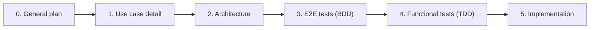

# `plan/` — Planning Workspace

This folder is the source of truth for every feature delivered by
`blockexplorer-tui`. It precedes code: nothing is implemented before the matching
plan section exists and the tests derived from it are in place.

## Working philosophy

See [`0-general-architecture.md`](0-general-architecture.md) for the non-negotiable
rules (hexagonal layers, module boundaries, runtime model, global navigation,
external-only data policy).

## Index

| #  | File                                                           | Scope                     | Status |
|----|----------------------------------------------------------------|---------------------------|--------|
| 0  | [0-general-architecture.md](0-general-architecture.md)         | Navigation + architecture | draft  |
| 1  | [1-home.md](1-home.md)                                         | Home screen               | done   |
| 2  | [2-search.md](2-search.md)                                     | Universal search          | done   |
| 3  | [3-block-detail.md](3-block-detail.md)                         | Block detail screen       | done   |
| 4  | [4-tx-detail.md](4-tx-detail.md)                               | Transaction detail        | done       |
| 5  | [5-mempool.md](5-mempool.md)                                   | Mempool stream            | done (MVP) |
| 6  | [6-address-detail.md](6-address-detail.md)                     | Address detail            | done       |
| 7  | [7-contract-detail.md](7-contract-detail.md)                   | Contract detail           | done       |
| 8  | [8-token-detail.md](8-token-detail.md)                         | Token detail              | done (MVP) |
| 9  | [9-gas-tracker.md](9-gas-tracker.md)                           | Gas tracker               | done (MVP) |
| 10 | [10-settings.md](10-settings.md)                               | Settings                  | done (MVP) |
| 11 | [11-rust-scaffolding.md](11-rust-scaffolding.md)               | Rust project scaffolding  | draft  |
| 12 | [12-screen-runtime.md](12-screen-runtime.md)                   | TUI runtime + demo mode   | done   |
| 13 | [13-alchemy-adapter.md](13-alchemy-adapter.md)                 | Alchemy HTTP adapters     | done   |
| 14 | [14-config-and-credentials.md](14-config-and-credentials.md)   | Config + feed wiring      | done   |
| 15 | [15-backlog.md](15-backlog.md)                                 | Backlog (pendências 0–14) | draft  |
| 16 | [16-probe-findings-and-deferred.md](16-probe-findings-and-deferred.md) | Probe findings + consolidated deferred backlog | draft  |

Status values: `draft` (still in planning), `ready` (ready to implement), `done`
(implemented and covered by passing tests), `deferred`.

### Deferred (not part of MVP)

- NFT detail screen and NFTs tab in Address detail.
- Holders tab in Token detail.
- Watchlist screen.
- Transaction simulator screen.
- Validators / Beacon chain screen.
- Blocks list and Transactions list (removed entirely; not just deferred).

## Naming convention

Plan files are named `{N}-{scope}.md`, where `N` is a monotonically increasing
integer and `scope` is a short kebab-case identifier. The general architecture is
always `0-general-architecture.md`.

## Glossary

Core domain terms used consistently across files and code.

- **Chain**: a specific blockchain network (for example `ethereum`, `base`,
  `polygon`, `optimism`). Identified by chain id and a human slug.
- **Block**: an entry in the chain. Fields: number, hash, parent hash, timestamp,
  validator / fee recipient, gas used / limit, base fee, withdrawals, txs.
- **Transaction (Tx)**: a signed message executed at a block position. Has a hash,
  from, to, value, gas, input data, logs, receipt, status.
- **Receipt**: the outcome of a tx (status, gas used, logs, effective gas price).
- **Address**: a 20-byte account on the chain. Can be an EOA or a contract.
- **Contract**: an address with bytecode. May be verified (source + ABI available)
  and may be a proxy pointing to another implementation.
- **Proxy**: a contract delegating execution to an implementation. Detected via
  EIP-1967 storage slots and a few fallback signatures.
- **Token**: a contract implementing a fungible standard (ERC-20 in MVP).
- **Transfer**: an asset movement recorded on-chain. Categories: external, internal,
  ERC-20, ERC-721, ERC-1155, special NFT.
- **Gas**: the unit of computation on EVM chains. Measured in wei, shown in gwei.
- **Wei / Gwei / Ether**: units. 1 ether = 10^9 gwei = 10^18 wei.
- **Trace**: a structured breakdown of a tx's internal calls and state changes.
- **AssetChange**: the net effect of a tx on an address for a given asset.
- **Label**: a human-readable name attached to an address by Etherscan.
- **Signature**: a function selector (4 bytes) or event topic (32 bytes) with its
  textual signature, used to decode calldata and logs when an ABI is not available.
- **Use case**: a single user-visible behaviour, implemented in
  `src/application/use_cases/`. Each use case corresponds to one or more scenarios
  in a `.feature` file.
- **Port**: a trait in `src/application/ports/`. The only thing use cases depend on
  for external interaction.
- **Adapter**: an implementation of a port under `src/adapters/`. The only thing
  that touches I/O.

## How to add a new plan file

1. Pick the next available `N`.
2. Create `plan/{N}-{scope}.md` with at least these sections: Purpose, Layout,
   Keybindings, Use cases, Ports required, Data sources, BDD scenarios, Functional
   tests, Fixtures, Open questions.
3. Register the file in the Index table above.
4. Write the `.feature` file under `tests/e2e/features/` and red functional tests
   under `tests/functional/` before touching production code.
